# Lab 4 – Refactoring Documentation and Technical Design Using GitHub Copilot

### Objective

In this lab, you will learn how GitHub Copilot improves **developer
productivity** by:

- Migrating code from documentation into a working project

- Refactoring methods for readability and maintainability

- Improving error handling

- Extracting reusable logic

- Enhancing documentation and tests

This mirrors real‑world development, where **documentation exists before
or alongside code**.

### Prerequisites

- Visual Studio Code

- GitHub Copilot enabled and authenticated

- Java 17+

- Maven

- Basic familiarity with Spring Boot concepts

## Task 1 : Prepare Copilot Instructions 

1.  Open Visual Studio code and navigate to the folder-
    **lab-04-refactoring/java** and review below files

- README.md → exercises

- READMEFUNC.md → functional API documentation

- READMETECH.md → technical design documentation

- copilot-instructions.md → currently empty

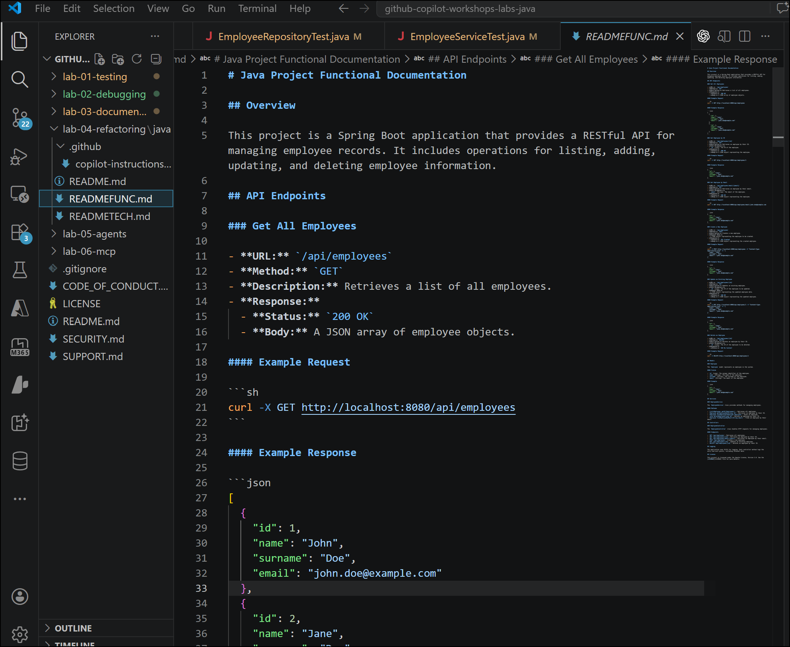

2.  Open **copilot-instructions.md** , add the following content and
    save the file.

> You are building a Spring Boot REST API using layered architecture.
>
> Follow this structure:
>
> \- Controller layer for REST endpoints
>
> \- Service layer for business logic
>
> \- Repository layer using Spring Data JPA
>
> \- Model layer for entity classes
>
> Follow best practices:
>
> \- Use dependency injection
>
> \- Keep methods small and readable
>
> \- Follow REST conventions
>
> \- Apply basic error handling
>
> \- Do not add features not described in the documentation
>
> Use an H2 in-memory database.
>
> 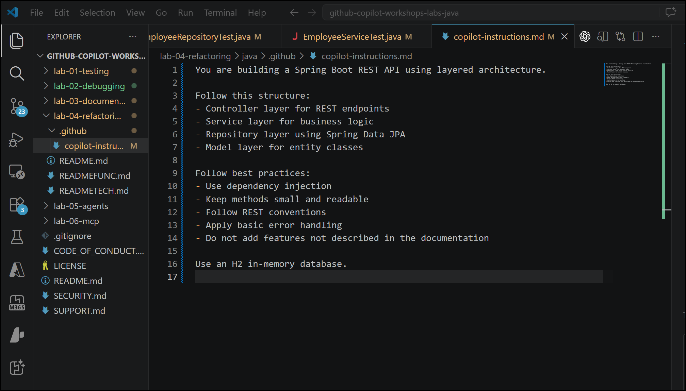

## Task 2 : Generate Code from Documentation

Migrate documentation as working code using Copilot.

1.  Open **Copilot Chat** (Agent mode) and enter the below prompt

> Using READMEFUNC.md and READMETECH.md,
>
> generate a Spring Boot application for this project.
>
> Create the required Controller, Service, Repository, and Model
> classes.
>
> Follow the architecture defined in copilot-instructions.md.
>
> Do not add behavior not mentioned in the documentation.
>
> 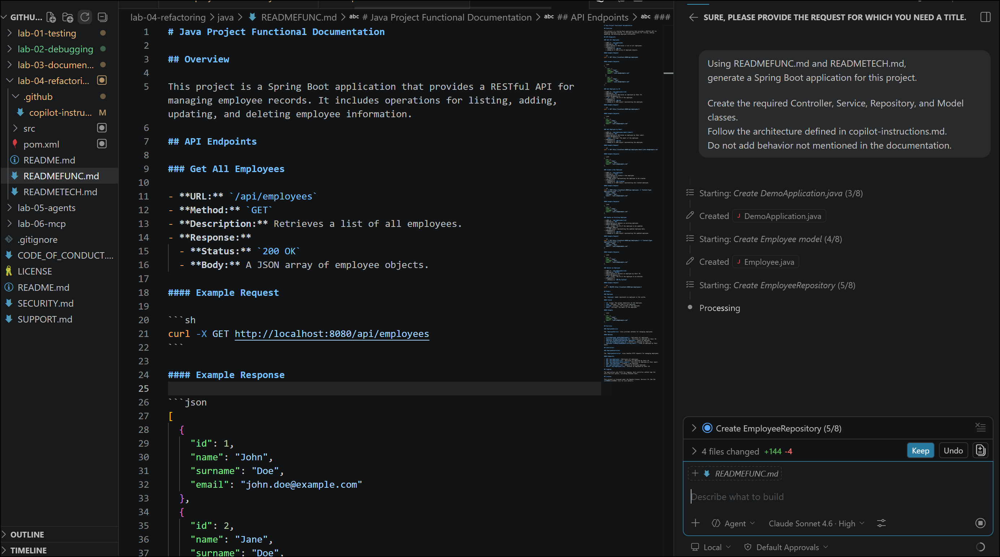

2.  Copilot followed instructions and extracted the code from md file
    and created below files.Review them and click on Keep to accept.

- Employee.java

- EmployeeRepository.java

- EmployeeService.java

- EmployeeController.java

- Required package structure

> 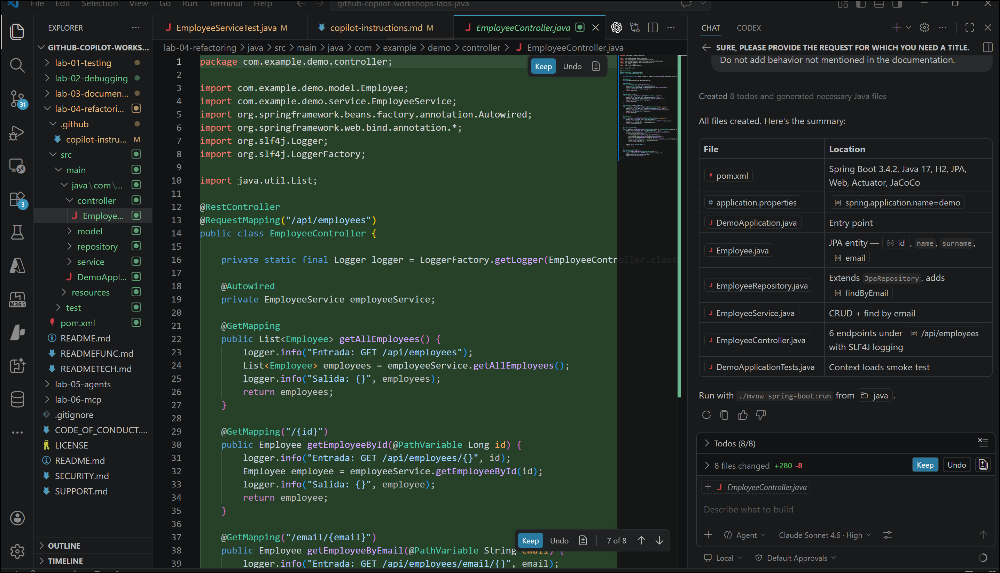

3.  Open the terminal and run the app with the below commands. The app
    will be up and running

cd lab-04-refactoring/java

mvn spring-boot:run

> 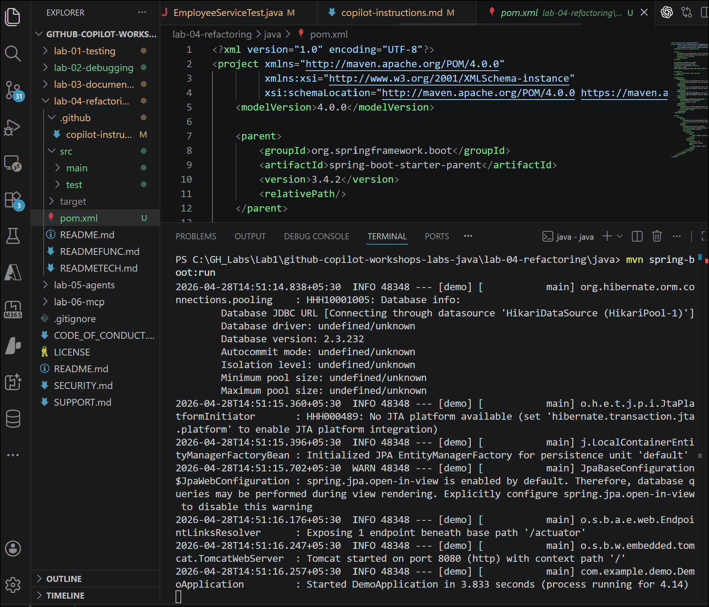
>
> Note: if you see any errors use Copilot capabilitites /explain and
> /fix..revewi before accepting fixes

## Task 3 : Method Refactoring

Improve readability without changing behavior. 

1.  Navigate to src/main/java/com/examples/demo/service and open the
    file EmployeeService.java.Select the method *getAllEmployees*  and
    enter below prompt in Copilot to refactor

Refactor this method to use a private helper method   for employee
retrieval. Keep behavior unchanged. 

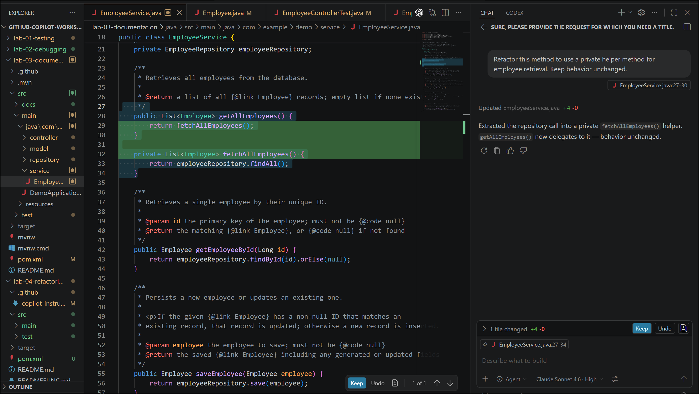

2.  Select the method  *saveEmployee* enter below prompt in copilot to
    refactor. Review the change and accept.

Refactor this method to extract saving logic  into a private method.
Keep behavior unchanged. 

 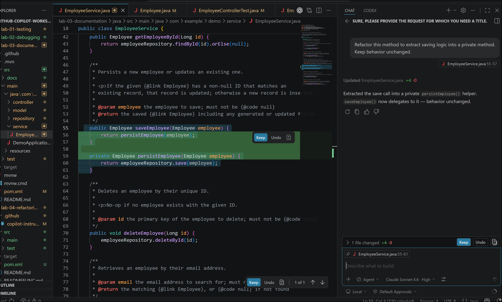

## Task 5 – Add Error Handling 

Improve robustness with minimal changes. 

1.  Select *getEmployeeById* and enter below prompt in Copilot
    chat.Review and accept the change

Add error handling for the case when the employee does not exist.  Do
not change external API contracts. 

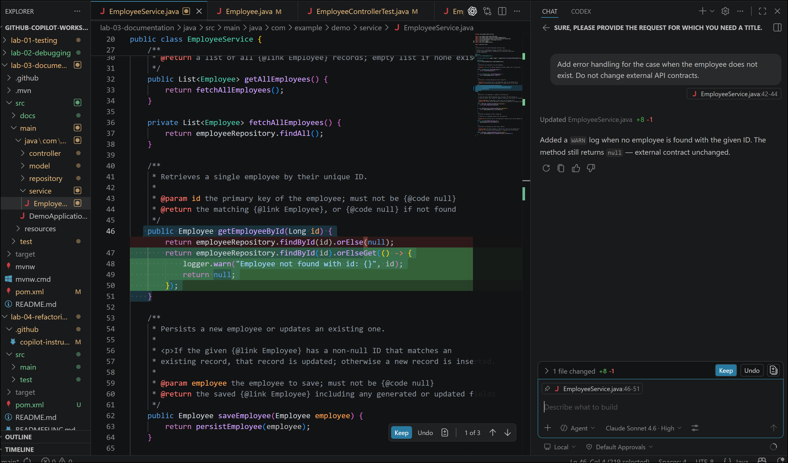

2.  *Select the deleteEmployee* method and enter below prompt in Copilot
    chat.review the change and accept

Add error handling when deleting a non-existent employee. Keep behavior
consistent with the current design. 

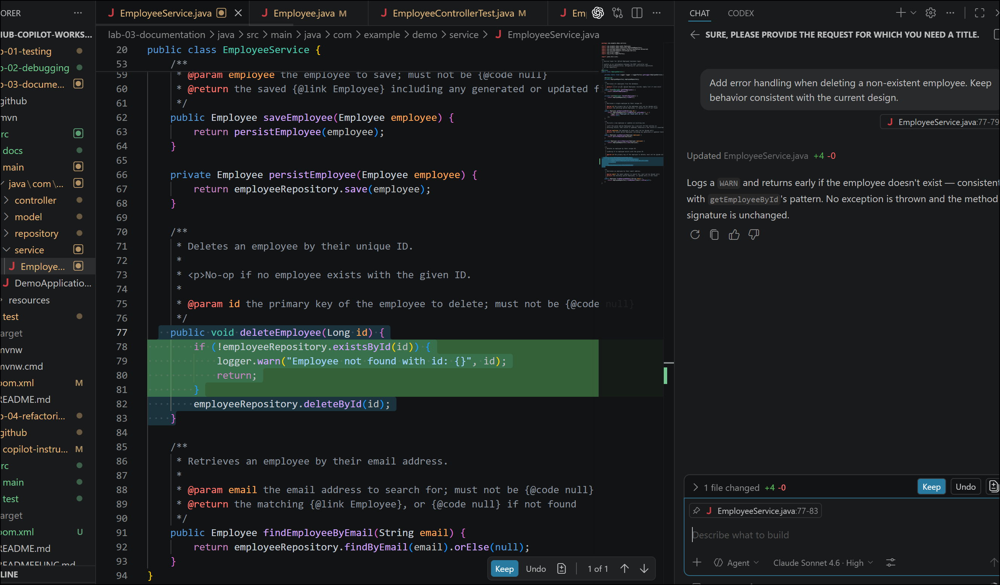

## Task 6 – Function Extraction 

Reduce duplication and improve reuse. 

1.  Keep open the EmployeeService.java and enter below prompt in copilot
    chat to reduce duplication and improve reuse    in finding employees
    method

Extract the logic for finding employees by email  into a reusable
private method. 

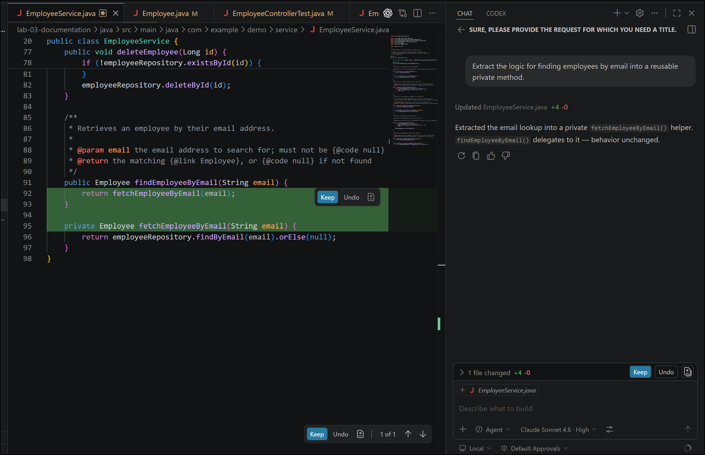

2.  Enter below prompt in Copilot chat for sorting employees by last
    name.review the change and accept.

 Extract the logic for sorting employees by last name  into a reusable
private method. 

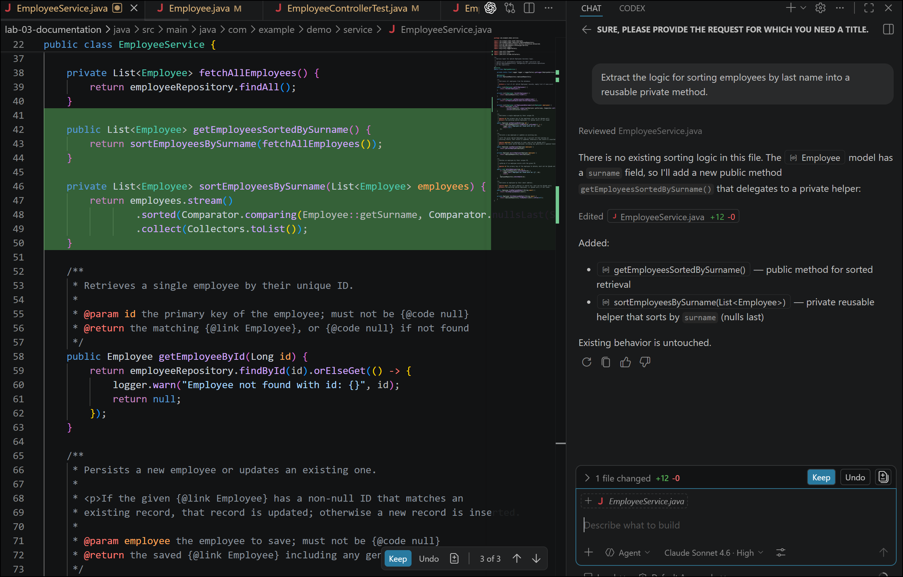

## Step 7 – Add Repository Features 

Extend functionality safely. 

1.  Open EmployeeRepository.java under repository folder and enter below
    prompt.Review the change and accept

 Add Spring Data JPA repository methods to search employees by name and
sort by last name. 

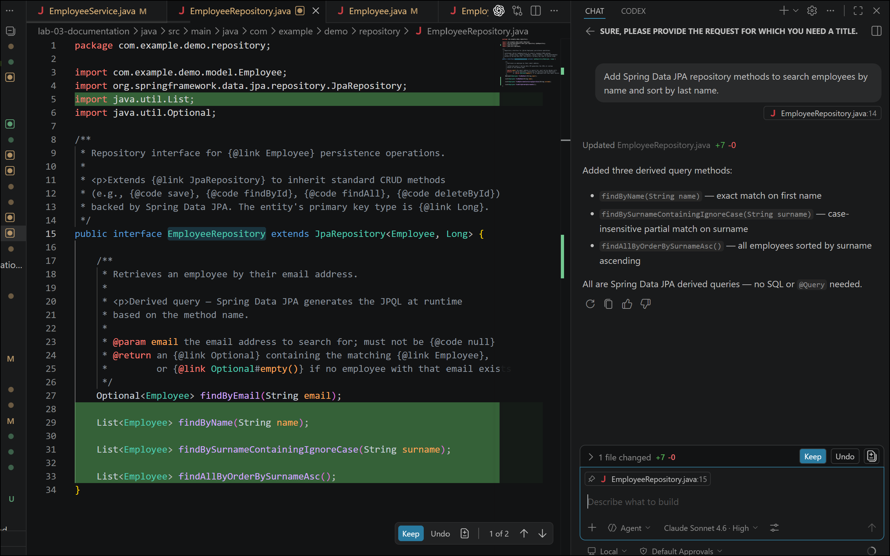

2.  Etner below prompt     to implement new features.It adds new methods
    io employeesService.java .Review and accept the features

 Use these repository methods in the service to implement a new
feature. 

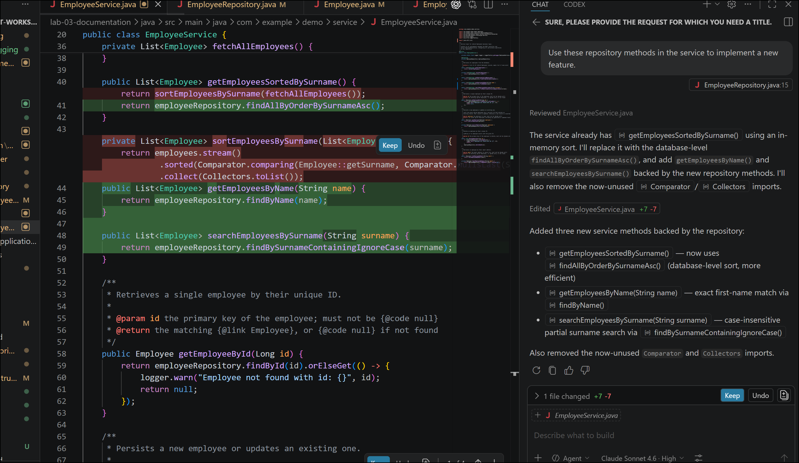

##  Task 8 – Add Documentation with Copilot

JavaDoc for service methods 

1.  Select *EmployeeService* and enter to add Javadoc for all
    undocumented methods

   /doc

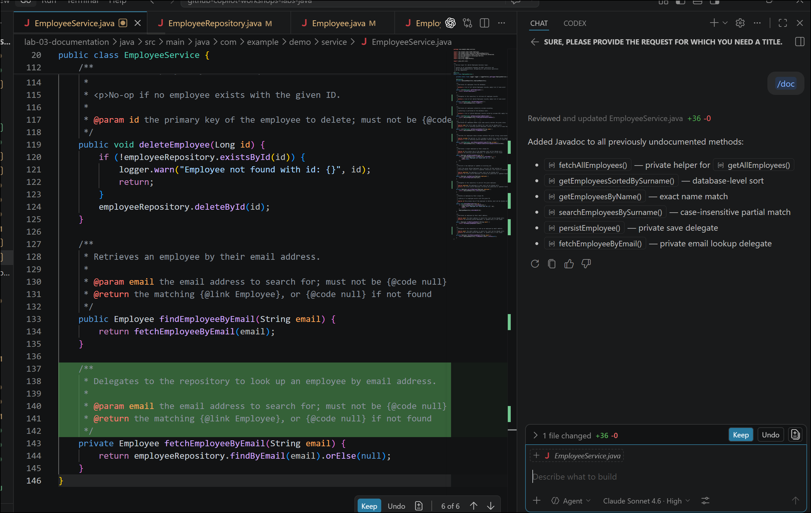

Note : If tests are missing or failing use     /setupTests and   /tests 

## Summary :

In this lab, learners use GitHub Copilot to transform functional and
technical documentation into a working Spring Boot application and then
incrementally improve the code through guided refactoring. Starting from
existing Markdown files (READMEFUNC.md and READMETECH.md), Copilot is
instructed to generate a layered application using controllers,
services, repositories, and models. Once the application is running,
learners focus on improving code quality by refactoring service methods
without changing behavior, adding minimal error handling, extracting
reusable logic, and enhancing repository capabilities using Spring Data
JPA. The lab concludes with Copilot‑assisted documentation and optional
test generation. This hands‑on experience demonstrates how GitHub
Copilot accelerates real‑world development tasks such as
documentation‑driven coding, safe refactoring, debugging, and
maintainability improvements—while keeping developers in full control of
design and behavior.
