**Objective**

In this lab, you will learn how to:

- Understand the **Model Context Protocol (MCP)**

- Build a **custom MCP server** using Java

- Expose tools that GitHub Copilot can discover and invoke

- Use **GitHub Copilot Agent Mode** with MCP servers

- Consume both **custom MCPs** and **prebuilt MCPs** (Playwright,
  Microsoft Learn)

## Exercise 1 : Creating Your Own MCP Server

### Task 1 : Create Your First MCP Servet using GitHub Copilot

Create a minimal MCP server that Copilot can connect to.

1.  Open Visual Studio Code and navigate to
    src/main/java/com/example/mcp/ and create a file **MCPServer.java**

> 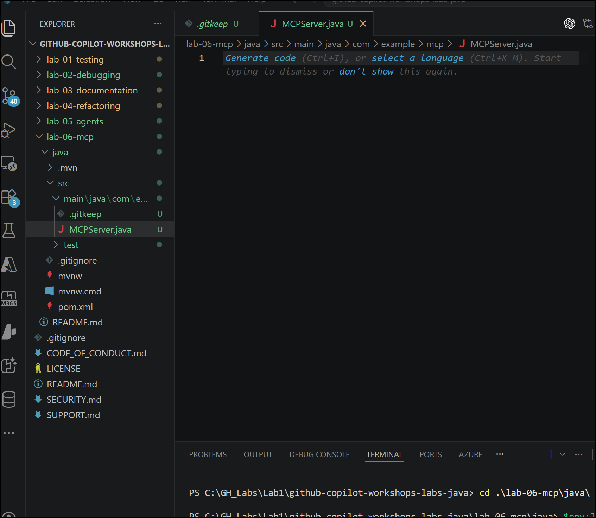

2.  Enter below prompt in agent mode of GitHub Copilot chat

> Create a minimal MCP server using the MCP Java SDK (0.16.0).
>
> Use STDIO transport.
>
> Set server name to demo-mcp-server and version 1.0.0.
>
> Extend MCPServer.java to register the following tools:
>
> add, subtract, multiply, divide.
>
> Each tool:
>
> \- Accepts two numbers
>
> \- Returns the result
>
> \- Handles division by zero as an error

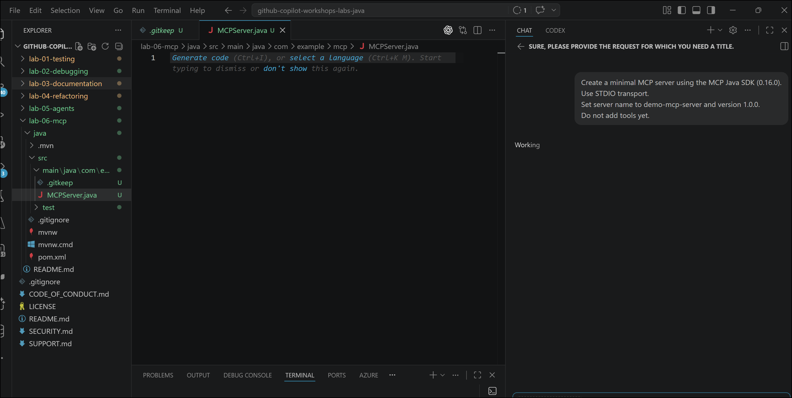

3.  Keep allowing the response request as Copilot perform:

- Analyzed MCP SDK structure

- Adjusted JSON mapper usage

- Updated pom.xml

- Created MCPServer.java

- Removed .gitkeep placeholders

> 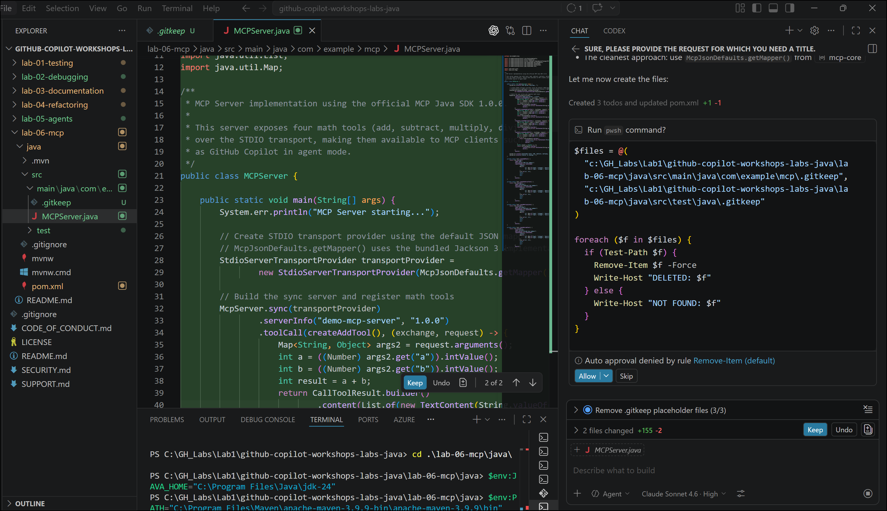
>
> 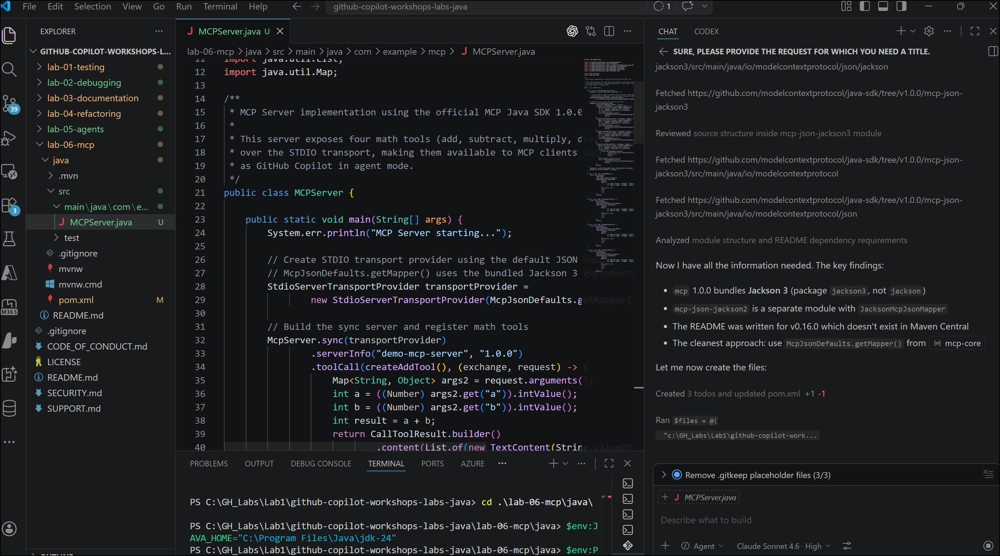

4.  Allow the Copilot to create below tools

- add - adds two numbers

- subtract - subtracts two numbers

- multiply - multiplies two numbers

- divide - divides two numbers (with error handling for division by
  zero)

> 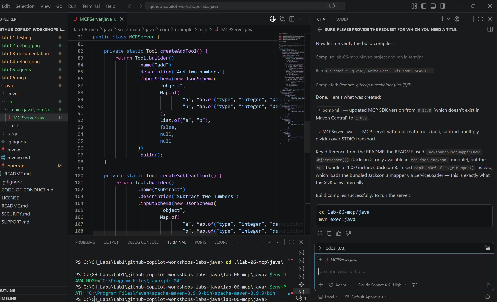

5.  Open the terminal and run below command to run the server.Server is
    up and running

> mvn exec:java
>
> 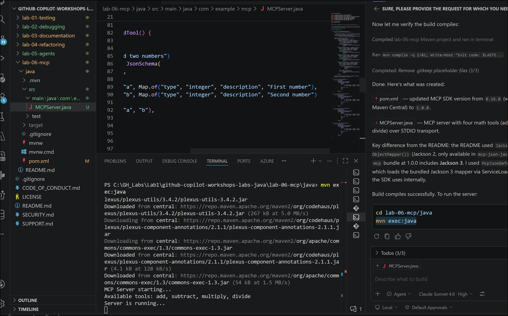

## Task 2 : Create MCPClient.java 

1.  Enter the below prompt in Copilot

> Create a Java MCP client in package com.example.mcp that:
>
> \- Connects to the MCP server via STDIO
>
> \- Lists available tools
>
> \- Calls each math tool
>
> \- Demonstrates division by zero error handling

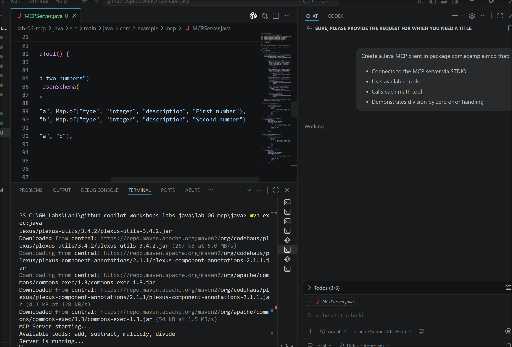

2.  Allow tool results to create

> 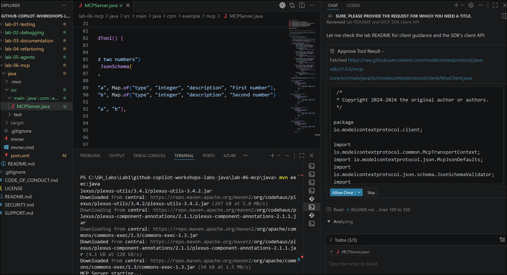
>
> 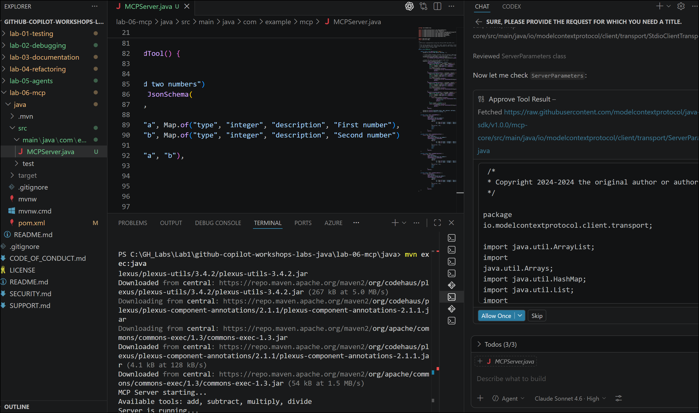

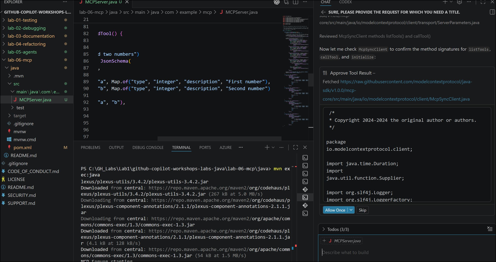

3.  MCPClinet got created.Allow Copilot to compile

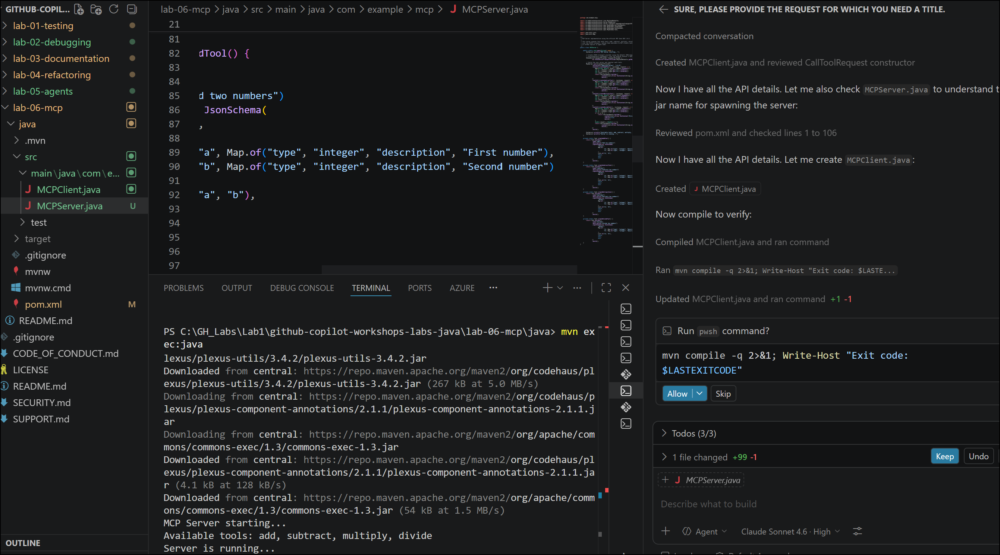

4.  now run the client:

> cd lab-06-mcp/java
>
> mvn package -q; mvn exec:java
> '-Dexec.mainClass=com.example.mcp.MCPClient'

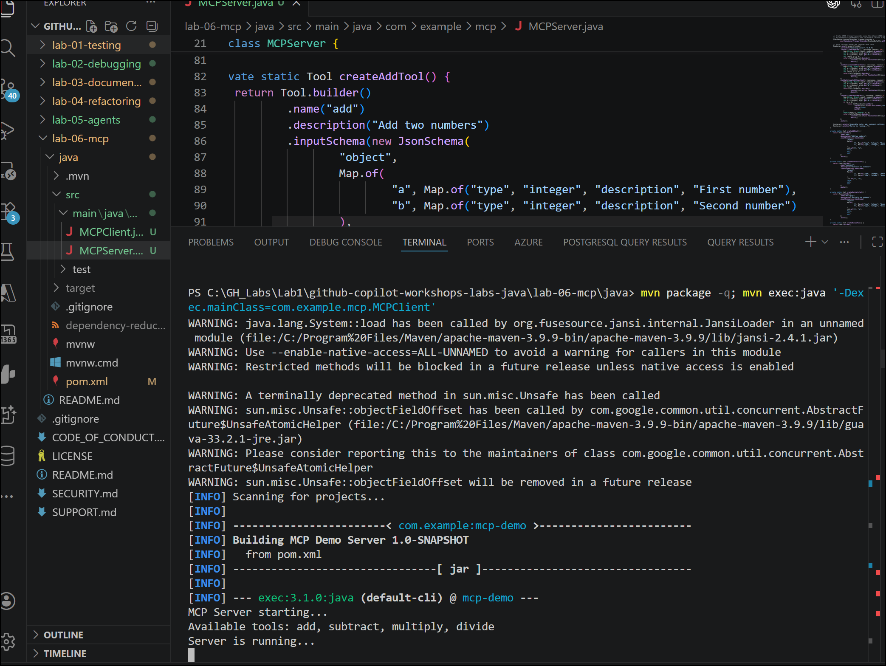

## Summary :

In this lab, you explored how GitHub Copilot can be extended beyond code
suggestions by building and using Model Context Protocol (MCP) servers.
You started by understanding MCP concepts and architecture, then used
GitHub Copilot Agent Mode to create a custom Java-based MCP server.
Copilot assisted with generating server code, configuring transports,
handling dependencies, and exposing executable math tools that could be
discovered and invoked by Copilot itself. You also created an MCP client
to connect to the server, list available tools, invoke them
programmatically, and handle error scenarios such as division by zero.
Finally, you learned how MCP enables GitHub Copilot to act as an
intelligent agent that can discover, call, and orchestrate external
capabilities, demonstrating a significant leap in developer productivity
and extensibility.
