# Lab 8- Improving code quality and maintainability with GitHub Copilot

### Scenario 

You've just been assigned to the **"OrderFlow"** team at a mid-size
e-commerce company. The previous developer has left abruptly. You've
inherited **a working but poorly written order processing
module** — **order_processor.py**. The code runs, the business depends
on it, and **you are now the owner**.

Your tech lead's teams message reads:

*"The order processor works, but it's a mess. No tests, no docs, cryptic
names everywhere, copy-paste logic all over the place. We need you to
clean it up before we can add the new discount feature next sprint.
Don't break anything."*

In this lab, you'll use GitHub Copilot as your AI pair programmer
to **understand, refactor, test, and document** inherited code while
maintaining a **code review mindset** at every step.

**Objectives (Copilot-Focused)**

By the end of this lab, you will be able to:

1.  Use **/explain** and Copilot Chat to analyze and understand
    unfamiliar code.

2.  Apply Copilot-assisted **refactoring** to improve naming, eliminate
    duplication, and reduce complexity.

3.  Make deliberate **accept/refine/reject decisions** on every Copilot
    suggestion.

4.  Use **/tests** and Copilot Chat to generate meaningful unit tests
    for inherited code.

5.  Use **/doc** and natural language prompts to generate **docstrings,
    inline comments, and a README**.

6.  Validate all changes with a **test-first safety net** so refactoring
    never breaks behavior.

## Task 1: Understand the Problem — Human Reasoning First

Before asking Copilot anything, **read the code yourself** and note
what's wrong. This trains the code review mindset.

1.  Create a folder in your C:/Lab08 and open it in Visual Studio Code.
    Open terminal-\>GitBash

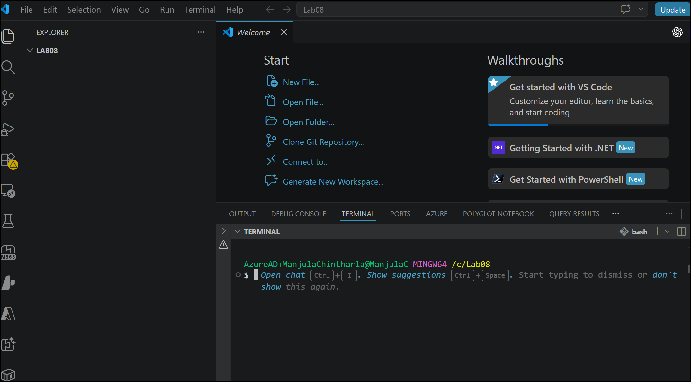

2.  Run below command and clone the repo

git clone
<https://github.com/technofocus-pte/GitHub-Copilot-orderflow-cleanup>

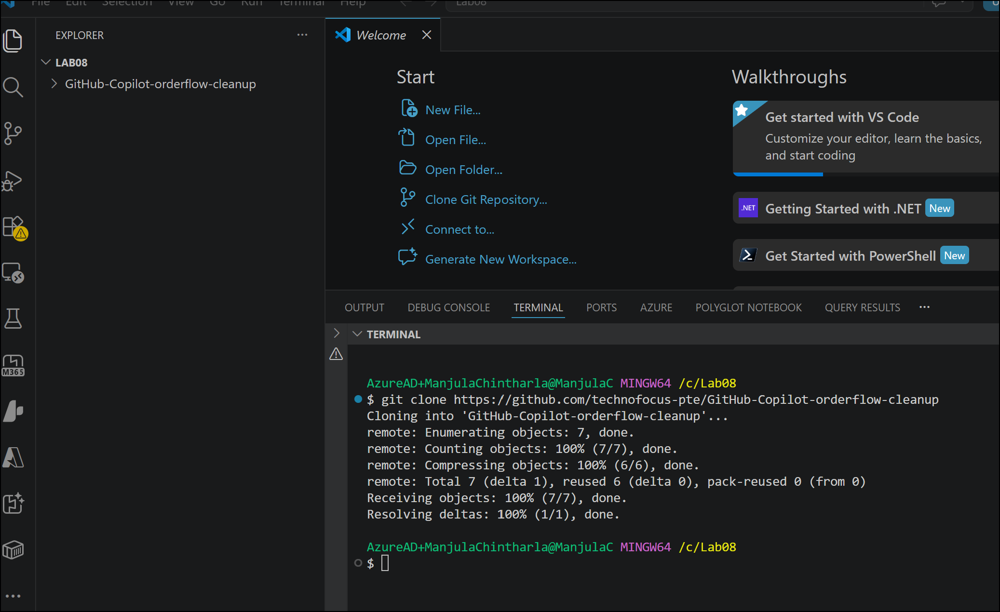

3.   Open **order_processor.py **and create a list of code smells on
    paper or in a scratch comment block at the bottom of the file.

> **Note:** Spend 5 minutes and identify as many issues as you can.

\# === CODE REVIEW NOTES ===

\# 1. Variable names: d, o, t, p, q, r, s, tt — all cryptic,
single-letter

\# 2. proc() and proc_batch() contain nearly identical logic (copy-paste
duplication)

\# 3. Discount rates are hardcoded magic numbers (0.1, 0.2, 0.25)

\# 4. Tax rate (0.08) is a magic number buried in logic

\# 5. No docstrings, no type hints, no meaningful comments

\# 6. Empty order check happens AFTER calculation (wrong order of
operations)

\# 7. gen_report() uses string concatenation instead of f-strings or
templates

\# 8. No unit tests exist

\# 9. No README or module-level documentation

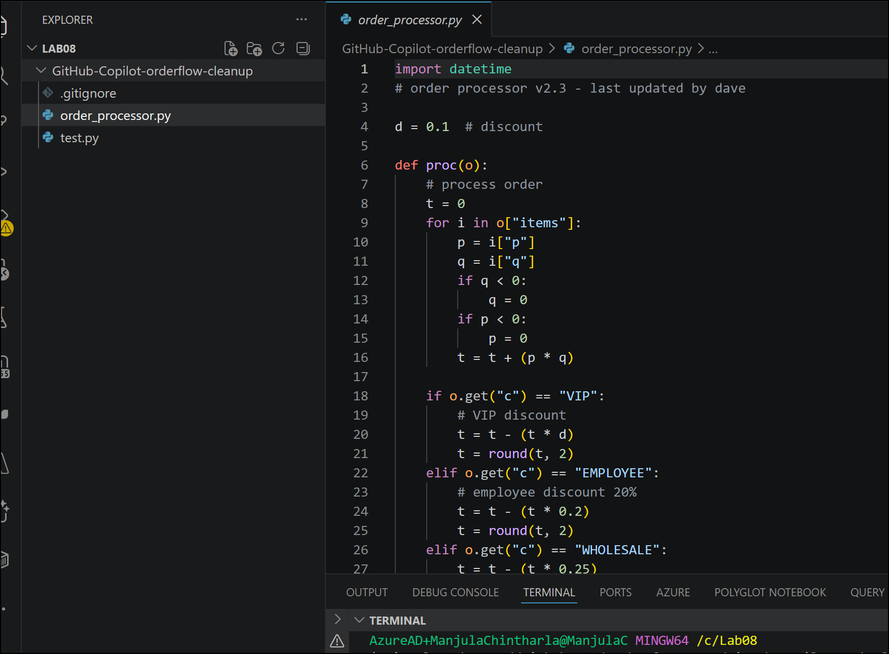

## Task 2: Use GitHub Copilot to Analyze and Explain the Code

Now let's validate and deepen your understanding using Copilot.

1.  **Explain the proc() Function Using /explain**

Select the **entire proc() function** in the editor. Open Copilot Chat
(Ctrl+Shift+I / Cmd+Shift+I) and type:

/explain

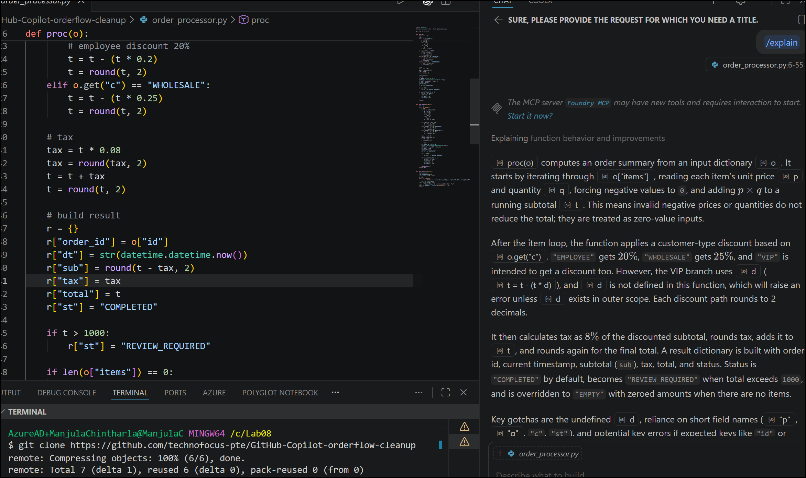

2.  Copilot should provide a plain-English explanation of what the
    function does: processes an order by calculating subtotal, applying
    customer-type discounts, adding tax, and returning a result
    dictionary.

Before you modify existing code you should make sure you understand its
purpose and how it currently works. Copilot can help you with this.​

3.  Read the explanation carefully.Does Copilot identify
    the **empty-order bug** (the empty check happens after calculation)?
    If not, note this — Copilot explained what the code *does*, not what
    it *should* do. **This is a critical distinction.**

**Note:** By providing concise explanations, Copilot can help give you a
clearer understanding of what the code is doing and
why.​​
However, emphasize: /explain describes *current behavior*, not *intended
behavior*. The developer must judge correctness.

## Task 3 — Ask Copilot to Identify Code Smells

1.  With order_processor.py open, type in Copilot Chat:

**Prompt:**

@workspace Review order_processor.py for code quality issues.

List all code smells including: poor naming, duplication, magic numbers,

missing error handling, structural problems, and maintainability
concerns.

Rank them by severity.

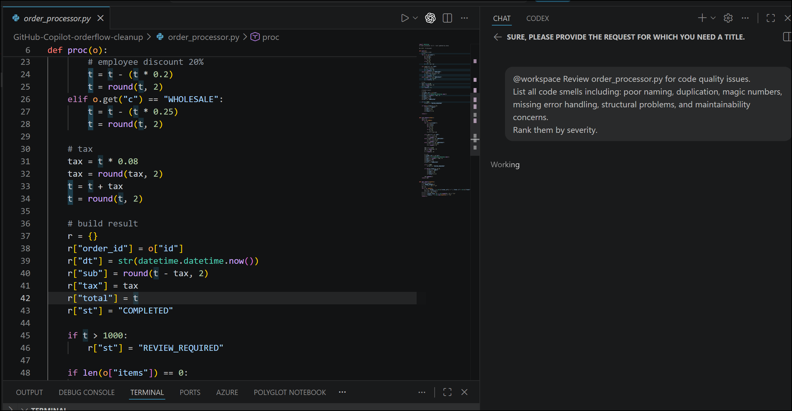

2.   Copilot should identify most (or all) of the issues you noted in
    Step 1, possibly organized by category and severity.

3.  Compare Copilot's list against your own notes from Step 1.

- Did Copilot find anything you missed? (Possibly: the lack of input
  validation on o\["id"\], or no error handling if items key is
  missing.)

- Did you find anything Copilot missed? (Possibly: the **logical
  ordering bug** — the empty check happens too late.)

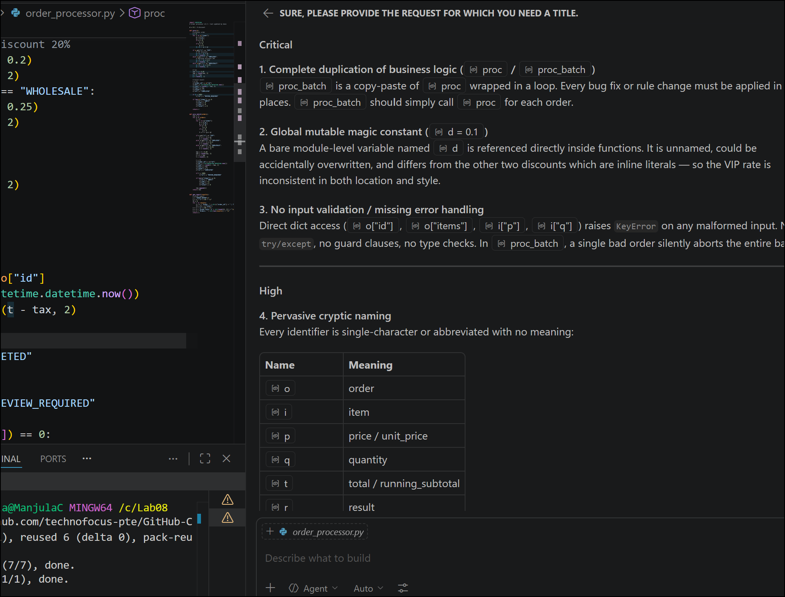

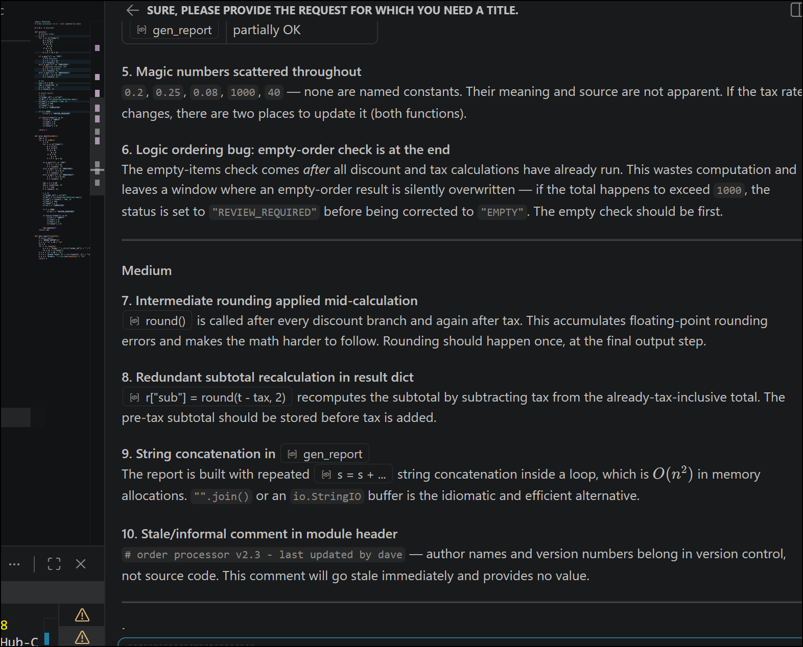

**Note:** This comparison exercise demonstrates the **human-AI
collaboration** model. Neither alone catches everything. Together,
coverage is far more complete.

## Task 4 — Ask Copilot to compare the two functions

1.  Enter below prompt to compare two functions and understand the
    response

**Prompt:**

Compare the proc() and proc_batch() functions in order_processor.py.

Identify duplicated logic and explain how they could be consolidated.

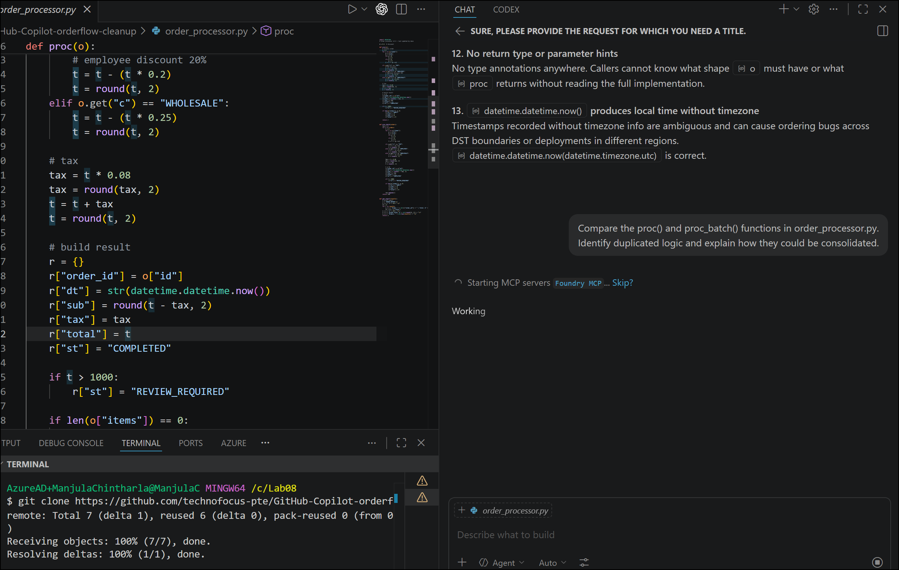

4.   Copilot should note that proc_batch() contains an **exact
    copy** of proc()'s logic inside a loop, and suggest
    that proc_batch() should simply call proc() for each order.

5.   This is a correct architectural observation. Copilot's refactoring
    direction is sound. We will act on it in next task

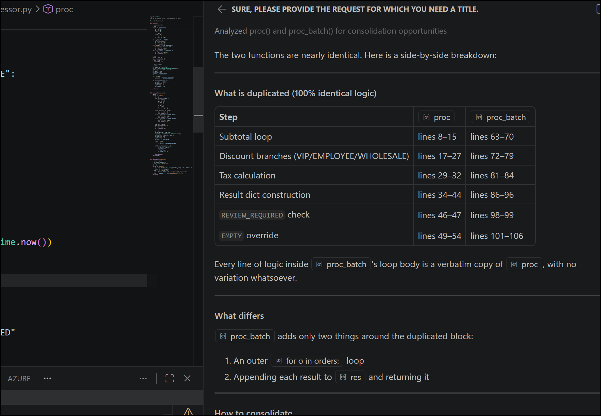

## Task 5: Refactor the code using Copilot — incremental, validated changes

We'll refactor in **five incremental passes**, creating a test safety
net first, then improving one dimension at a time.

Never refactor without tests. We'll write a "characterization test"
first — a test that locks in the *current* behavior, even if it's
imperfect.

### Create a Characterization Test (Safety Net)

1.  Create a new file: **test_order_processor.py** in the root
    folder**.** Type the following comment at the top and let Copilot
    help:

\# Characterization tests for order_processor.py

\# These tests capture the CURRENT behavior of the code before
refactoring

\# Purpose: ensure refactoring does not change observable behavior

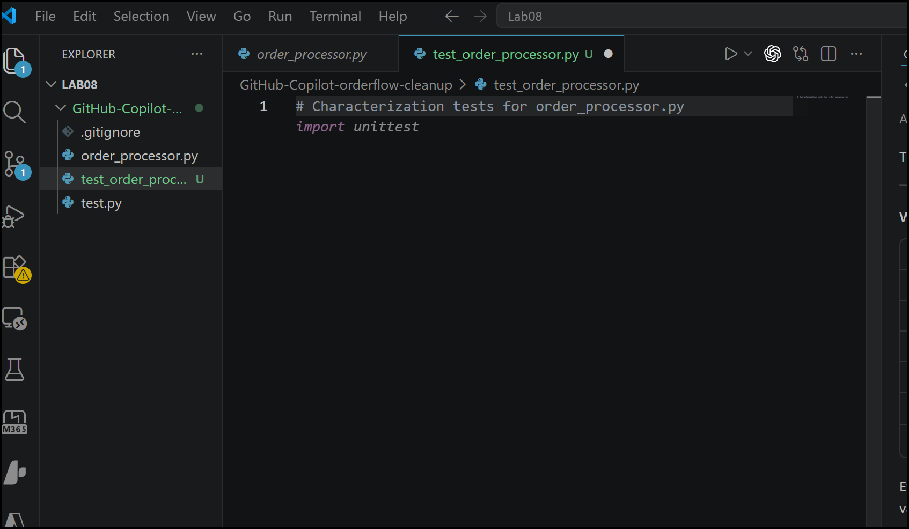

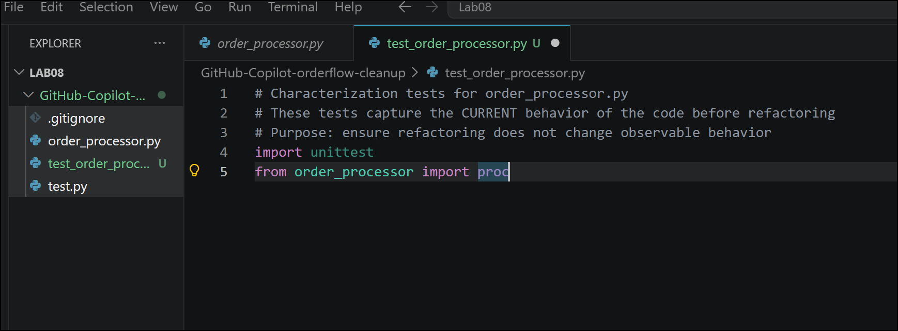

2.  Now open Copilot Chat, and type:

**Prompt:**

@workspace Generate characterization tests for the proc() function

in order_processor.py. These tests should capture the current behavior,

not the ideal behavior. Include tests for:

1\. A standard order with 2 items and no discount

2\. A VIP order (customer type "VIP")

3\. An EMPLOYEE order

4\. An order with an empty items list

5\. An order where item quantity is negative

Use pytest. Calculate the expected values manually to match current code
behavior.

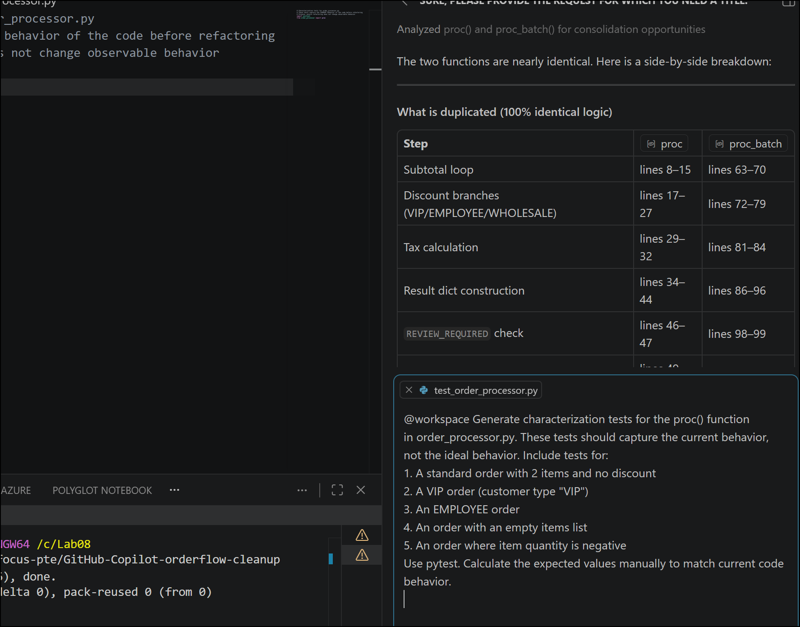

3.   Copilot should generate 5 test functions with hardcoded expected
    values that match the current proc() output.

> 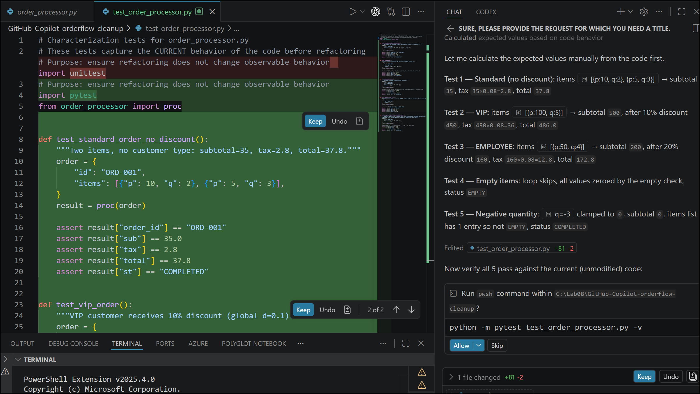

4.  Manually verify at least 2 expected values with a calculator. For
    example, for a VIP order with items \[{"p": 100, "q": 2}\]:

    - Subtotal: 200

    - VIP discount (10%): 200 - 20 = 180

    - Tax (8%): 180 × 0.08 = 14.40

    - Total: 194.40

- If Copilot's expected values don't match your manual
  calculation, **reject and correct**.

- Verify the "st" (status) field assertions match the threshold logic.

5.  **Open Terminal and run the tests:**

cd GitHub-Copilot-orderflow-cleanup/

pytest test_order_processor.py -v

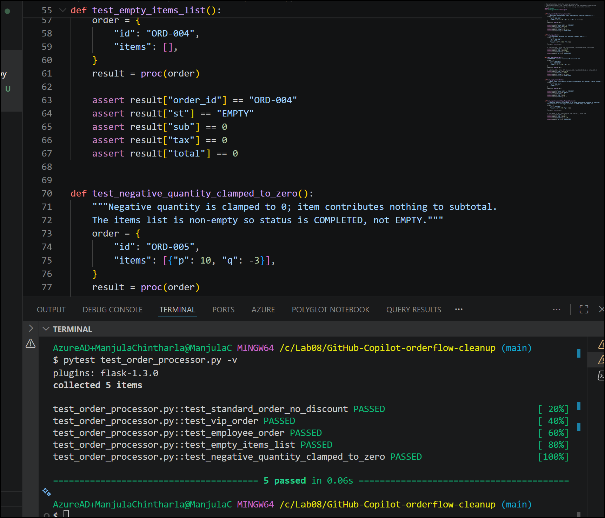

6.   All 5 tests pass. If any fail, the expected values need correction
    — fix them now. These tests are your safety net.

**Note:** Review suggestions carefully. Just like with human-generated
code, never trust any tests Copilot generates without going through your
normal review
process.​​
This is especially important for characterization tests — wrong expected
values mean your safety net has holes.

### Refactor 1: Fix Variable Names

1.  Open order_processor.py file and select
    the **entire proc() function**. Open **Copilot inline chat** (Ctrl+I
    / Cmd+I) and type:

**Prompt:**

Improve all variable names in this function to be descriptive and
readable.

Rename: d→discount_rate, o→order, t→subtotal, p→price, q→quantity,

r→result, i→item. Keep the exact same logic and behavior.

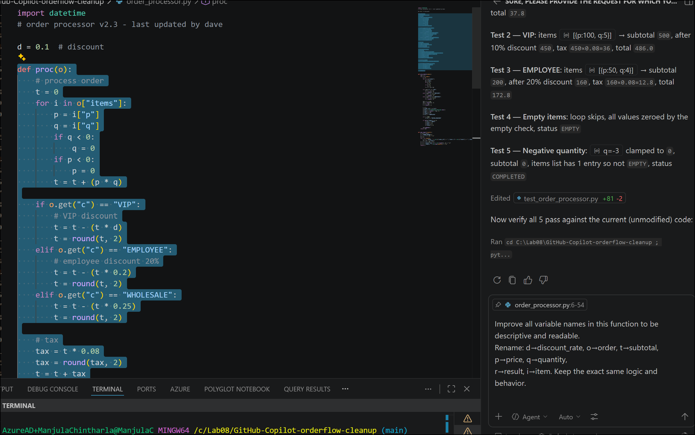

2.  Chat can help by suggesting improvements to variable names.​ It
    should rename all single-letter variables to descriptive names while
    preserving exact logic.

3.  VS Code will show you an inline diff. Check:

- Are **all** single-letter variables renamed?

- Is the logic **identical** — same calculations, same conditionals?

- Did Copilot accidentally change any computation? (e.g., reorder
  operations, alter rounding)

- Did Copilot rename the function itself? The prompt said to improve
  variable names *inside* the function. If it
  renamed proc → process_order, decide if you want that now or in a
  later pass.

4.  **Accept** the suggestion if the logic is preserved.

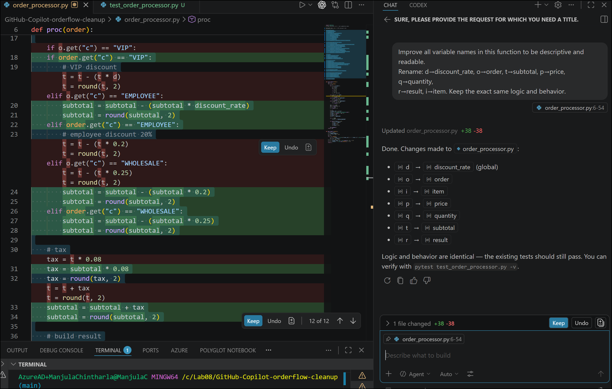

5.  Then immediately **run tests:**

pytest test_order_processor.py -v

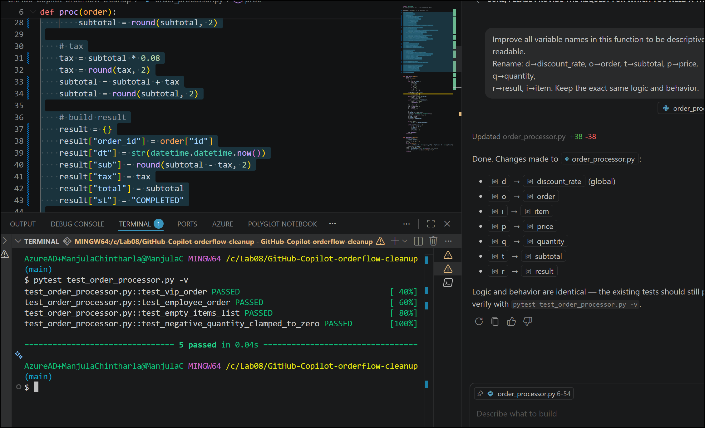

6.   All tests still pass. If any fail, **reject the refactor**, undo
    (Ctrl+Z), and re-prompt with more specificity.

**Note:** As with all Copilot suggestions, you should always check that
the revised code runs without errors and produces the correct result.​The
test-then-refactor-then-test cycle is the core discipline of this lab.

### Refactor 2: Extract Magic Numbers into Constants

1.  At the top of order_processor.py, type the following comment and let
    Copilot suggest:

\# Constants for discount rates and tax

\# VIP customers get 10% discount

\# Employee customers get 20% discount

\# Wholesale customers get 25% discount

\# Tax rate is 8%

\# Orders over $1000 require review

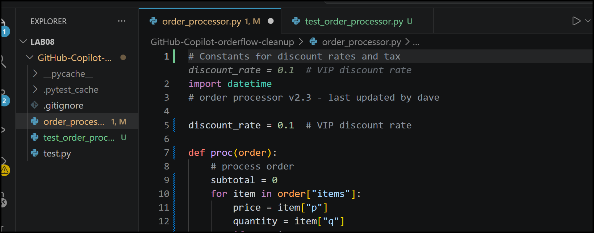

2.   Copilot should suggest:

VIP_DISCOUNT_RATE = 0.10

EMPLOYEE_DISCOUNT_RATE = 0.20

WHOLESALE_DISCOUNT_RATE = 0.25

TAX_RATE = 0.08

REVIEW_THRESHOLD = 1000

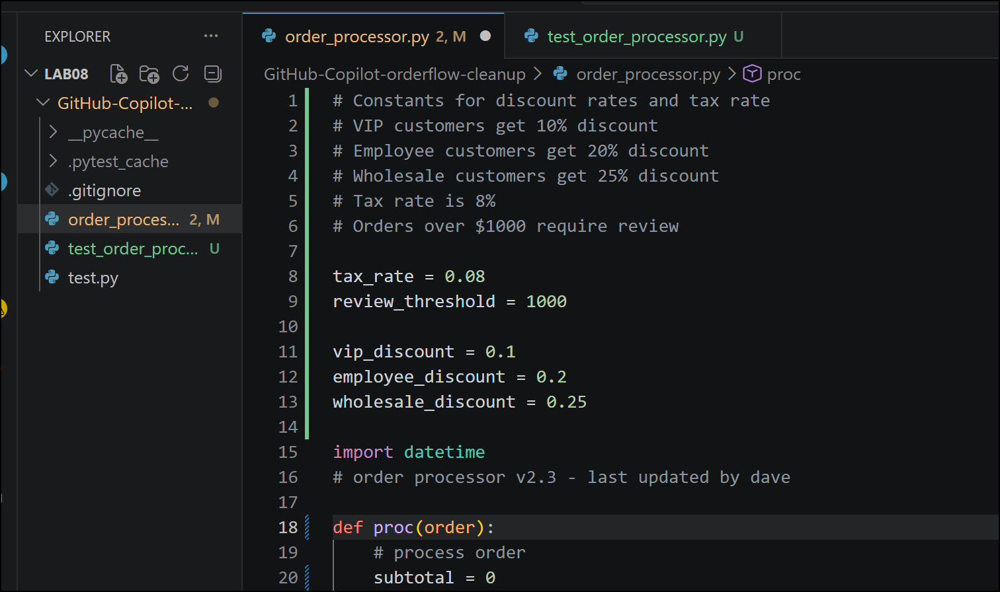

3.  Accept this suggestion — it's clean and follows Python conventions
    (UPPER_SNAKE_CASE).

4.  Now **manually** update the proc() function to use these constants
    instead of the hardcoded numbers.

But wait — let's ask Copilot to help. Select the proc() function and use
inline chat:

**Prompt:**

Replace all magic numbers in this function with the constants defined

at the top of the file: VIP_DISCOUNT_RATE, EMPLOYEE_DISCOUNT_RATE,

WHOLESALE_DISCOUNT_RATE, TAX_RATE, REVIEW_THRESHOLD.

Do not change any logic.

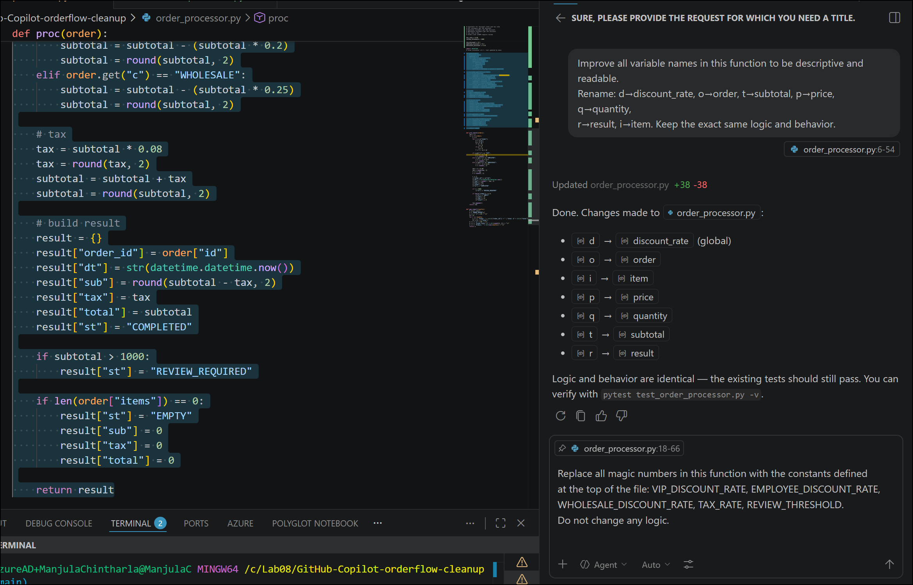

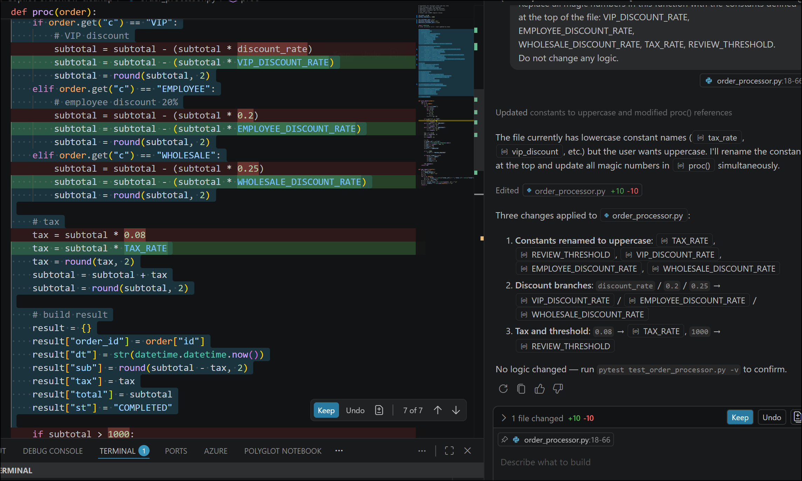

6.  **Review and accept.** Then immediately:

pytest test_order_processor.py -v

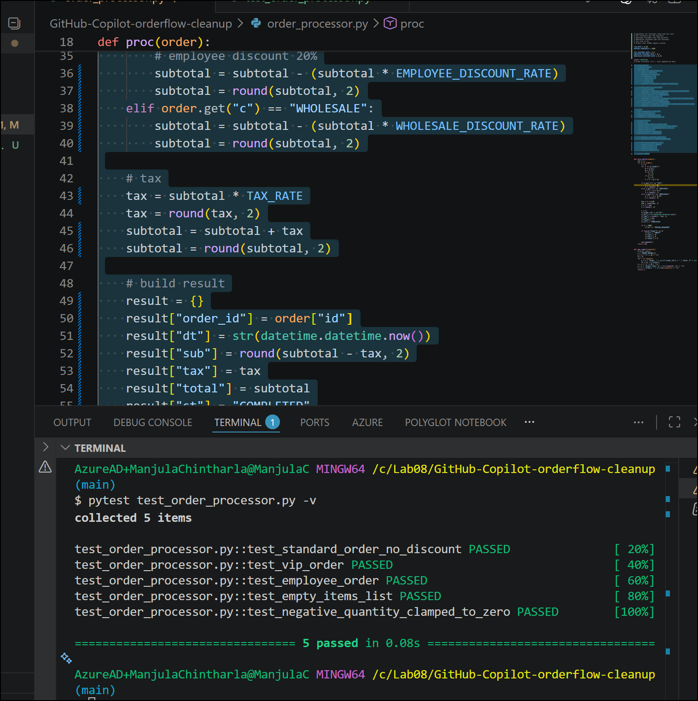

7.   All tests pass.

### Refactor 3: Eliminate Duplication Between proc() and proc_batch()

1.  This is the most impactful refactor. Enter the below prompt in the
    chat

**Prompt:**

@workspace The proc_batch() function in order_processor.py contains

duplicated logic from proc(). Refactor proc_batch() so it simply calls

proc() for each order in the list. Keep the return type the same (list
of results).

Do not modify proc() itself.

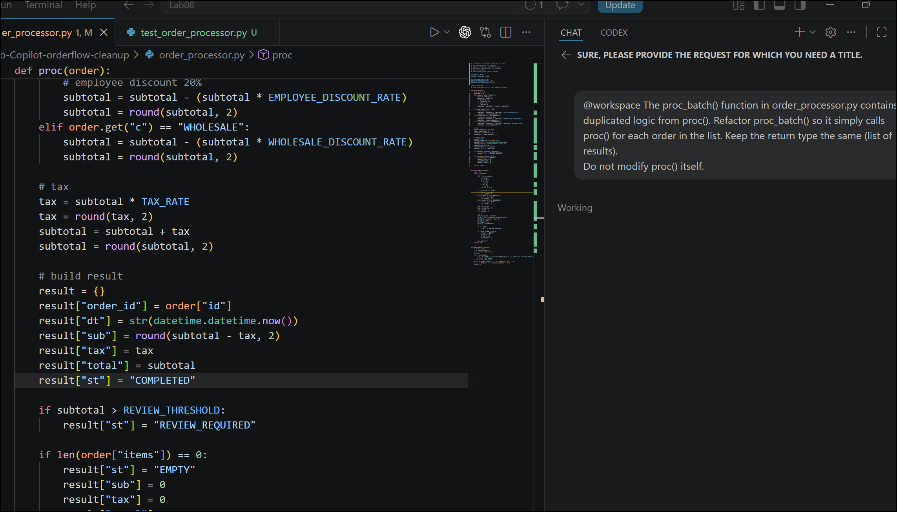

2.  Copilot should suggest:

def proc_batch(orders):

return \[proc(order) for order in orders\]

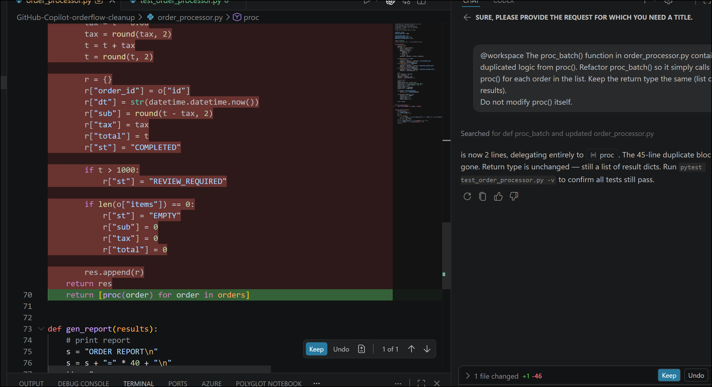

3.  Accept the suggestion. But we need a **test for proc_batch()** too.
    In Copilot Chat:

**Prompt:**

/tests Generate a pytest test for proc_batch() that processes 3 orders
(one standard, one VIP, one EMPLOYEE) and verifies that the result is a
list of 3 results with correct order_ids.

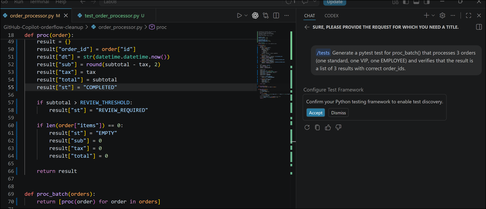

4.  Add the generated test to test_order_processor.py, review it, and
    run:

pytest test_order_processor.py -v

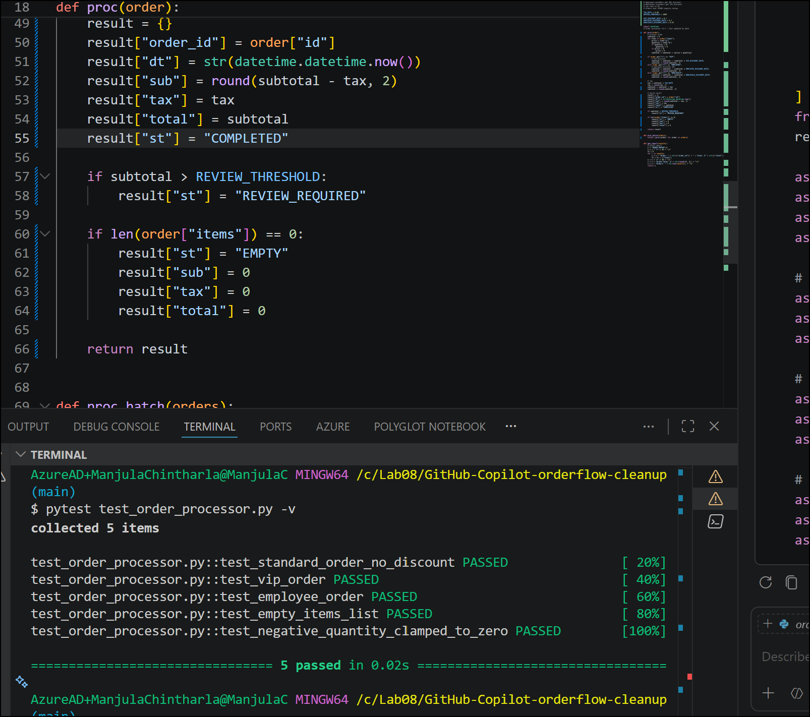

All tests pass, including the new batch test.

**Note:** Avoiding repetition will make your code easier to revise and
debug. For example, if the same calculation is performed more than once
at different places in a file, you could move the calculation to a
function.​ This is exactly the principle at work — Copilot correctly
identified the duplication and proposed the right architectural fix.

### Refactor 4: Extract Discount Calculation into a Helper

1.  The discount logic inside proc() uses an if/elif chain that will
    grow as new customer types are added. Let's extract it.

2.  Select the discount if/elif block inside proc() and open inline
    chat:

**Prompt:**

Extract the discount calculation into a separate function called

calculate_discount(subtotal, customer_type) that returns the discounted

subtotal. Use a dictionary mapping instead of if/elif chains.

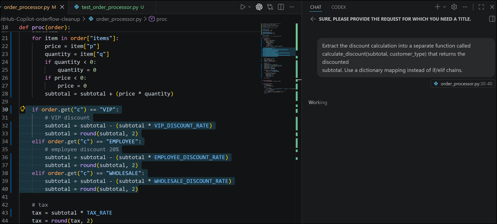

3.   Copilot suggests using a dictionary to map the animal types to
    their corresponding classes.​

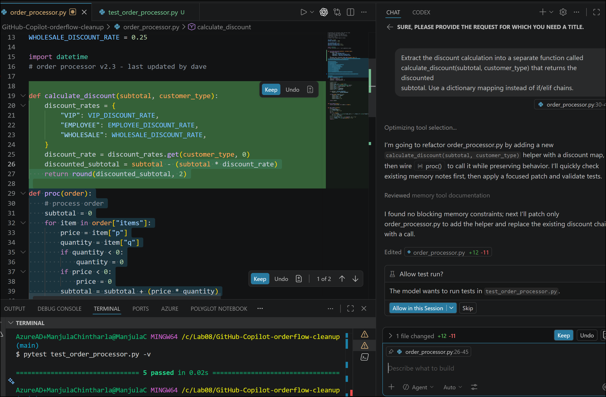
