## Lab 9 – Building rapid Full-Stack application prototyping with GitHub Copilot

### Scenario 

It's **Thursday at 2:15 PM.** Your engineering director drops this into
your team's channel:

*"The VP of Sales wants a quick demo of our new customer health scoring
idea at tomorrow's 10 AM leadership meeting. Nothing production-grade —
just something visual that shows a list of customers with health scores,
color-coded risk levels, and a detail view when you click a customer.
Can someone throw together a prototype by end-of-day? Doesn't need real
data — mock data is fine."*

You have **roughly 30 minutes** of focused time before your next
meeting. No boilerplate exists. No design mockups. Just a teams message
and a deadline.

This is exactly the kind of **rapid prototyping task** where GitHub
Copilot transforms a vague idea into a working, demo-ready application —
with you steering every decision.

**Objectives (Copilot-Focused)**

By the end of this lab, you will be able to:

1.  Use **Agent Mode** to scaffold an entire multi-file Flask web
    application from a single high-level prompt.

2.  Apply **iterative prompt refinement** to steer Copilot toward the
    exact outcome you need.

3.  Use **Ask Mode** to make design decisions (layout, color logic, data
    structure) before generating code.

4.  Evaluate Agent Mode output across **multiple generated
    files** simultaneously.

5.  Use **/explain**, **/fix**, and **/doc** standardized prompts to
    understand, repair, and document generated code.

6.  Recognize what Copilot does well in prototyping and **where
    developer judgment is still essential**.

**Note:** This lab starts from a **completely empty folder**. That is
the point — we're testing Copilot's ability to scaffold from zero.

**Prerequisites**

**Environment**

[TABLE]

## Task 0: Environment setup

1.  Create a folder **Lab09** in your C:/ drive and open it in Visual
    Studio code.

> 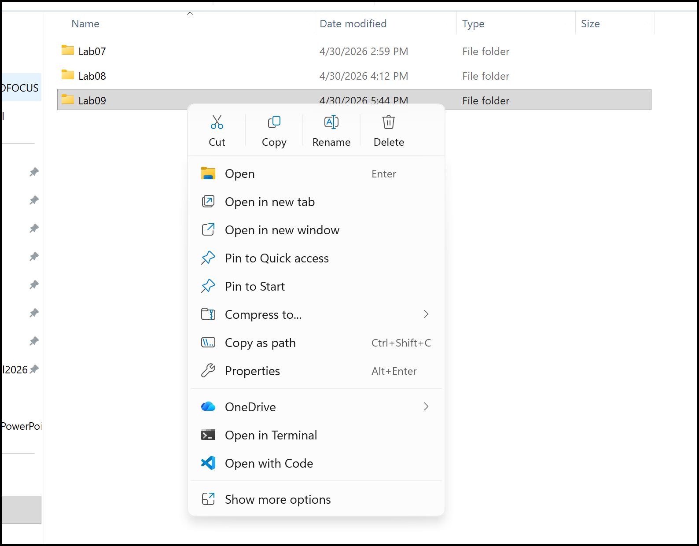

2.  Open a terminal -\> GitBash and run below command

mkdir customer-health-demo && cd customer-health-demo

python -m venv venv

source venv/Scripts/activate

pip install flask

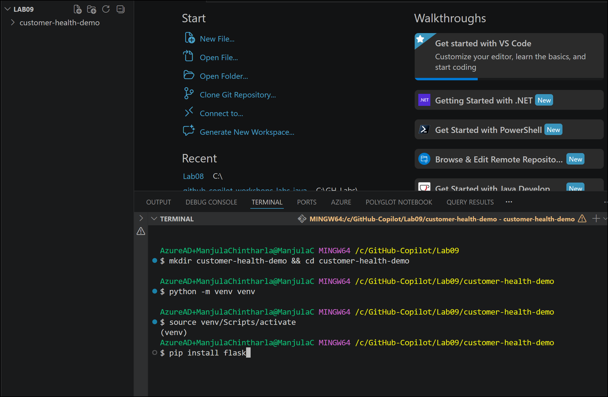

3.  Switch to **Agent Mode** in the Copilot Chat panel dropdown.

## Task 1: Understand the Problem — Think Before You Prompt 

Before opening Copilot, take 2 minutes to sketch the requirements on
paper or in a scratch note:

**Decompose the Ask:**

WHAT the VP needs to SEE at tomorrow's demo:

- A dashboard page showing a list of ~10 customers

- Each customer shows: name, industry, health score (0-100), risk level

- Risk levels color-coded: Green (70-100), Yellow (40-69), Red (0-39)

- Clicking a customer shows a detail page with more info

- Looks professional (not raw HTML)

WHAT this is NOT:

- Not a REST API (no JSON endpoints needed)

- Not production code (mock data is fine)

- Not a database application (in-memory is fine)

- Not mobile-responsive (desktop demo only)

TECH DECISIONS (mine, not Copilot's):

- Flask with Jinja2 templates (server-rendered HTML)

- Bootstrap 5 via CDN (instant professional styling)

- Mock data as a Python list of dictionaries

- Two pages: dashboard + customer detail

**Note:** Before writing a prompt, first give Copilot a broad
description of the goal or scenario. Then list any specific
requirements.​ This decomposition step is what separates a productive
Copilot session from an aimless one. The developer must **know the
destination** before asking Copilot to drive.

## Task 2: Use Ask Mode for Design Decisions 

1.  Before scaffolding, use **Ask Mode** to validate one design choice.
    Switch the Copilot Chat dropdown to **Ask** and type:

**Ask Mode Prompt:**

I'm building a Flask prototype with a customer health score dashboard.

Each customer has a health score from 0-100.

I want to color-code risk levels: Green (70-100), Yellow (40-69), Red
(0-39).

What's the cleanest way to implement this color logic —

in the Python backend, in the Jinja2 template, or in CSS classes?

Give me pros and cons of each approach for a quick prototype.

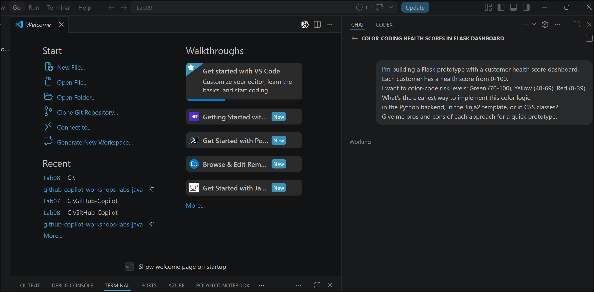

2.   Copilot should outline 3 approaches and recommend one. Likely
    recommendation: use **CSS classes mapped in the backend** (cleanest
    separation for a prototype).

Ask mode is the simplest of the three. You highlight some code, type a
question into Copilot Chat, and it generates an answer. It might explain
what the code does, suggest how to test it, give you a code snippet, or
remind you how to handle a particular edge case.​

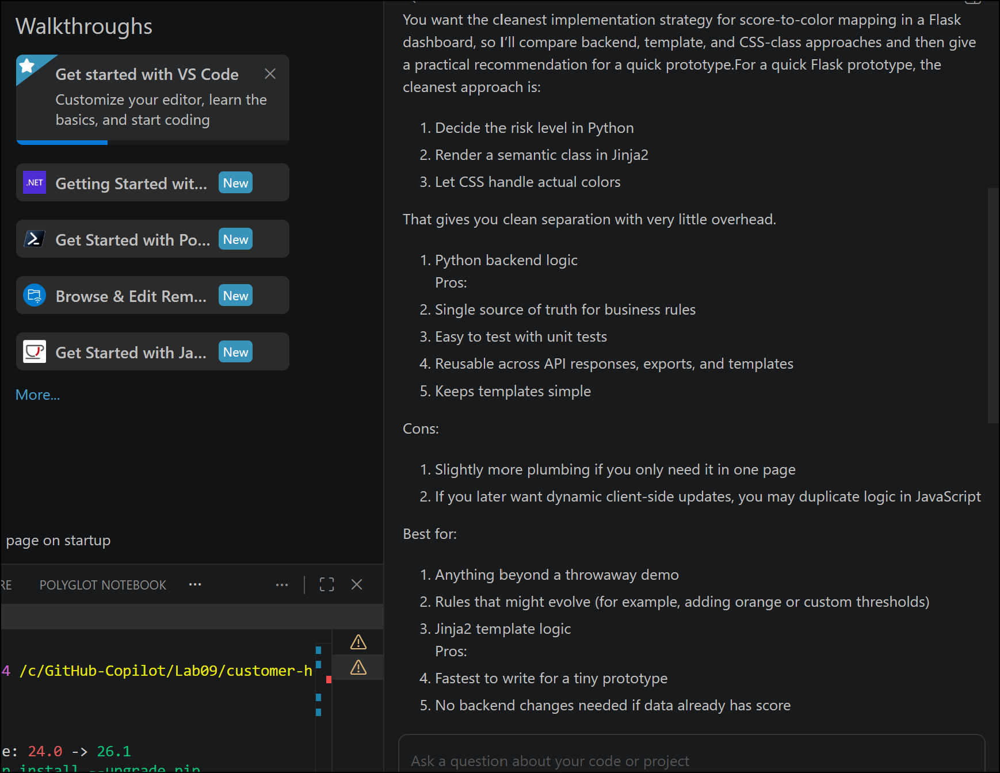

3.  Choose the approach that makes sense to YOU. For this lab, we'll
    use **CSS classes determined in the Python data layer** (e.g., each
    customer dict includes a risk_class field
    like "success", "warning", "danger" mapping to Bootstrap colors).

4.  This is a **developer decision** — Copilot advised, you decided.

**Note:** This step demonstrates using Ask Mode for **design
consultation** without generating any code. There's no project
commitment, no architectural decisions, and no code changes. Just
answers, right when you need them.​

## Task 3: Agent Mode — Scaffold the Entire Application 

1.  Switch the Copilot Chat dropdown back to **Agent**. Type the
    following carefully structured prompt:

**Prompt:**

Build a Flask web application prototype for a Customer Health Score
Dashboard.

PROJECT STRUCTURE:

\- app.py (Flask application with routes)

\- data.py (mock customer data — 10 customers)

\- templates/base.html (Bootstrap 5 base layout via CDN)

\- templates/dashboard.html (customer list with health scores)

\- templates/customer_detail.html (single customer detail view)

REQUIREMENTS:

1\. data.py should contain a list of 10 mock customers. Each customer
dict

should have: id, name, industry, health_score (0-100), risk_level

("healthy"/"at-risk"/"critical"), risk_class
("success"/"warning"/"danger"),

revenue (string like "$1.2M"), last_contact_date, and account_manager.

Make the data realistic — use real-sounding company names and varied
industries.

2\. app.py should have two routes:

\- GET / → renders dashboard.html showing all customers in a table

\- GET /customer/\<customer_id\> → renders customer_detail.html for one
customer

Return 404 if customer not found.

3\. templates/base.html should include Bootstrap 5 via CDN, a navbar
with

"CustomerIQ" as the brand name, and a content block.

4\. templates/dashboard.html should show a Bootstrap table with columns:

Customer Name (clickable link to detail page), Industry, Health Score,

Risk Level (displayed as a colored Bootstrap badge using risk_class),
Revenue.

5\. templates/customer_detail.html should show all customer fields in a

Bootstrap card layout with a "Back to Dashboard" link.

Do NOT use any database. Do NOT create a REST API. This is
server-rendered HTML only.

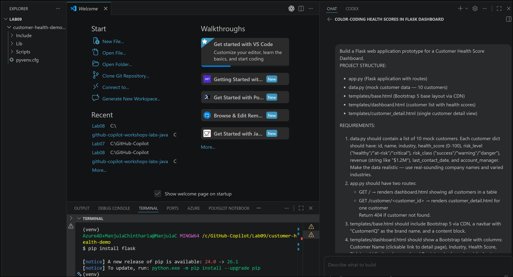

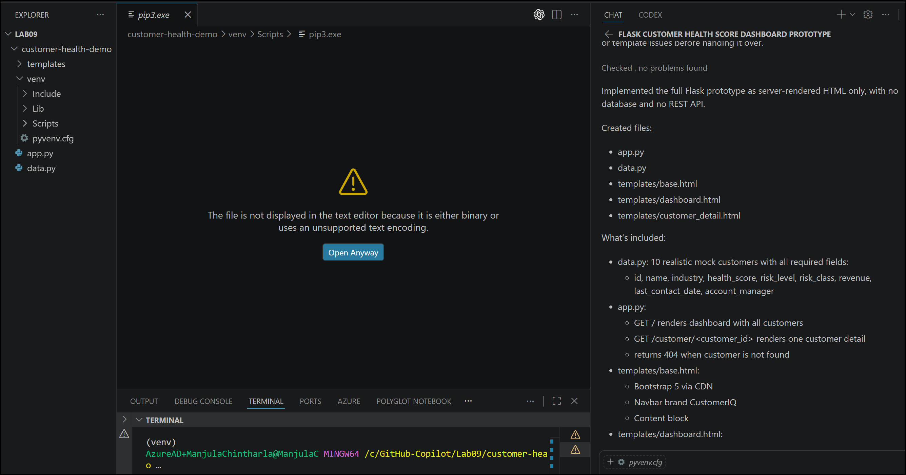

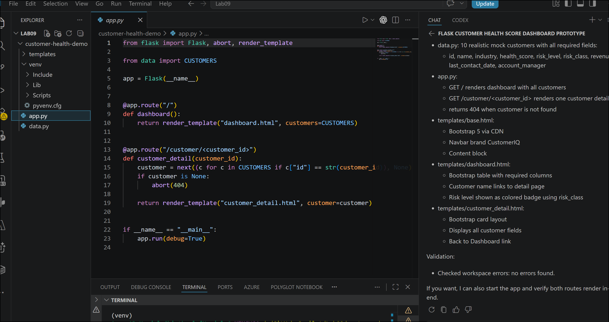

2.  After creating all files, run the app with: python app.py in the
    terminal or you can ask Copilot to start the app

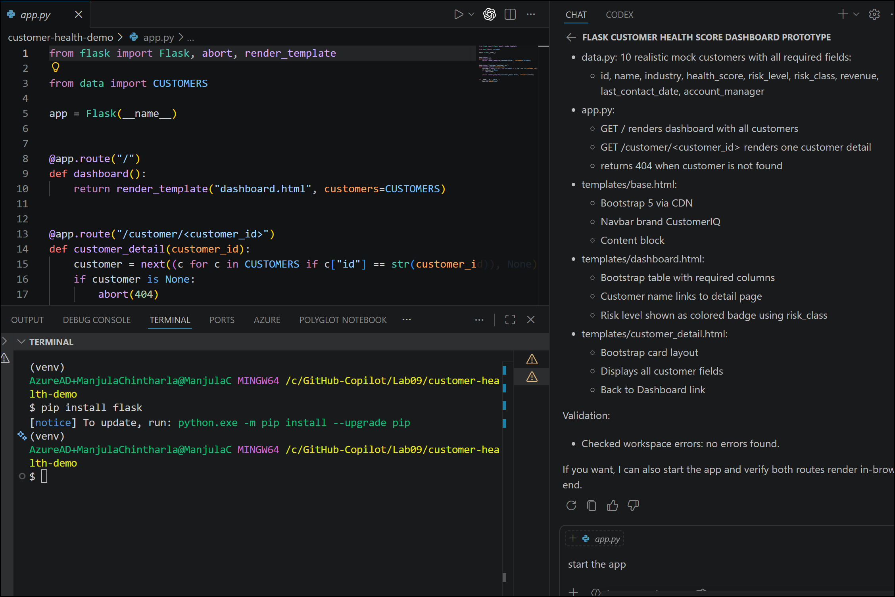

3.   Agent mode can analyze your codebase to grasp the full context,
    plan and execute multi-step solutions, run commands or tests, and
    run and refine its own work through an agentic loop, including
    planning, applying changes, testing, and iterating.​

Watch Agent Mode work. You should see it:

- **Create** data.py with 10 mock customer records

- **Create** app.py with Flask routes

- **Create** templates/ directory with 3 HTML files

- **Run** python app.py in the terminal

- **Detect** any errors and self-correct

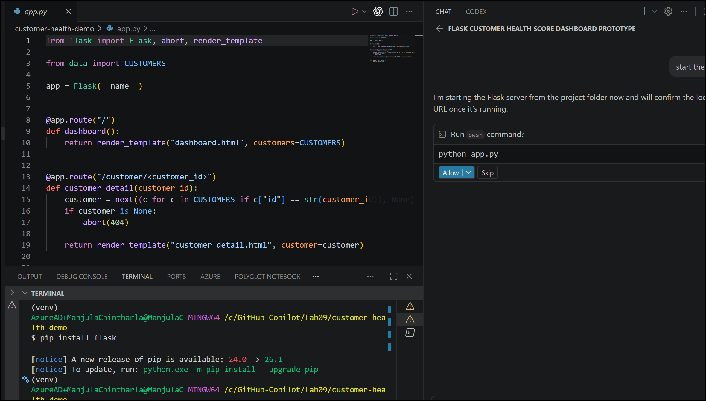

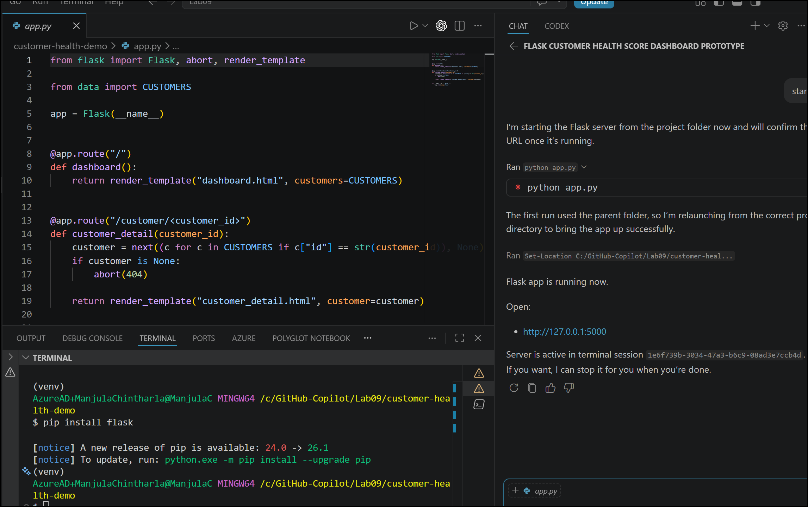

**IMPORTANT — Do NOT walk away.** Watch the Agent's terminal output.
When it runs the app, it will need to confirm that Flask starts on port
5000 without errors. If the Agent gets stuck in the terminal (waiting
for Flask's dev server to keep running), you may need to
press **Continue** or guide it.

4.  **Review the Generated Files:**

While the app runs, quickly scan each file:

[TABLE]

**Note:** Like working with any other developer, the more context you
give and the more specific you are about your intended outcome, the
better results you'll get from GitHub Copilot—and that's particularly
true with agent
mode.​​
The detailed prompt structure (project structure → requirements →
constraints) is what makes Agent Mode produce a usable result on the
first pass. A vague prompt like "build me a dashboard" would produce
something much less useful.

## Task 4: Validate and Fix — The Developer Is Still the Pilot 

1.  Open your browser to http://localhost:5000. Check:

- Dashboard table renders with 10 customers

- Health scores are visible as numbers

- Risk badges are color-coded (green/yellow/red)

- Clicking a customer name navigates to the detail page

- Detail page shows all customer fields

- "Back to Dashboard" link works

- Navbar shows "CustomerIQ" brand

**Document what works and what doesn't.**

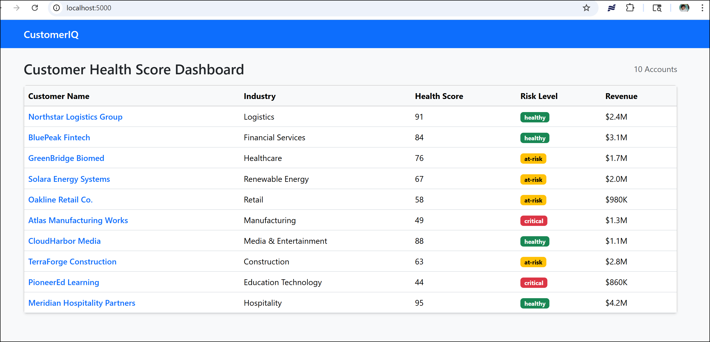

**Use /explain on the Generated Data**

2.  Select the customer list in **data.py**. In Copilot Chat (Ask Mode),
    type the standardized prompt:

**Prompt:**

/explain What does this code do and why might it fail?

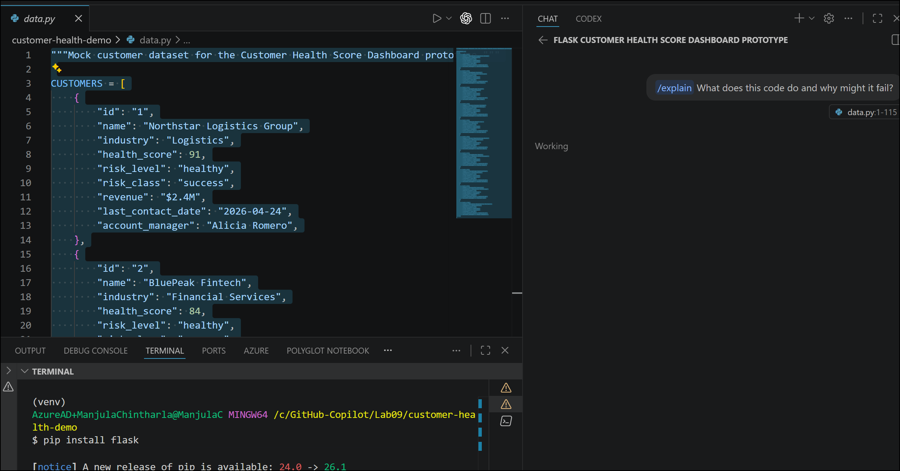

3.   Copilot should explain the data structure and may flag that:

- customer_id values need to be consistent between data.py and URL
  routing

- Date strings may not parse if used in calculations later

- risk_class must exactly match Bootstrap class names

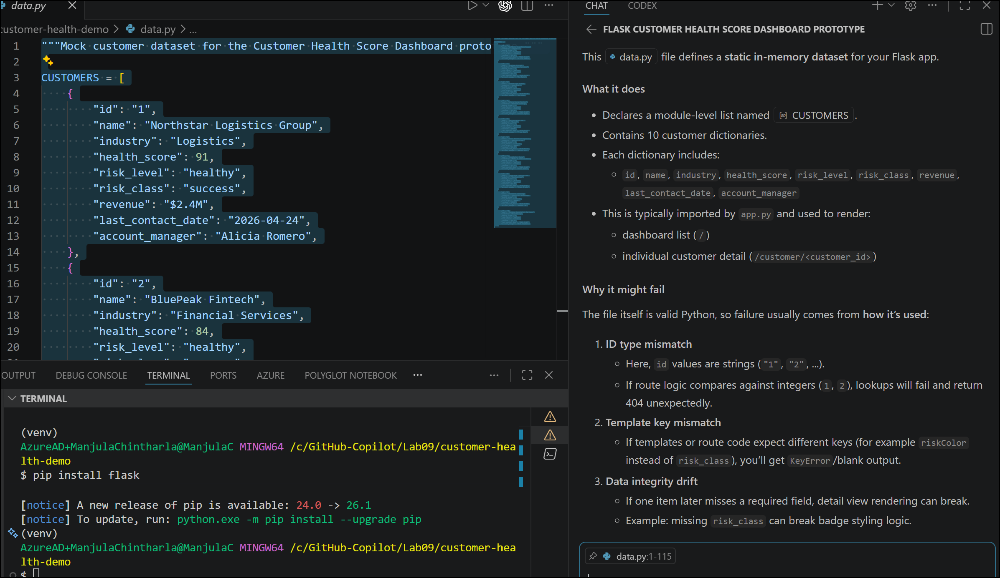

4.   Note any mismatches Copilot identifies. We'll fix them next.

**Use /fix for Any Issues Found**

5.  If the dashboard has visual bugs (e.g., badges aren't colored, links
    are broken), select the problematic template and type:

**Prompt — Fix Code:**

/fix Identify and fix only the issues causing this failure. Do not
rewrite unrelated logic.

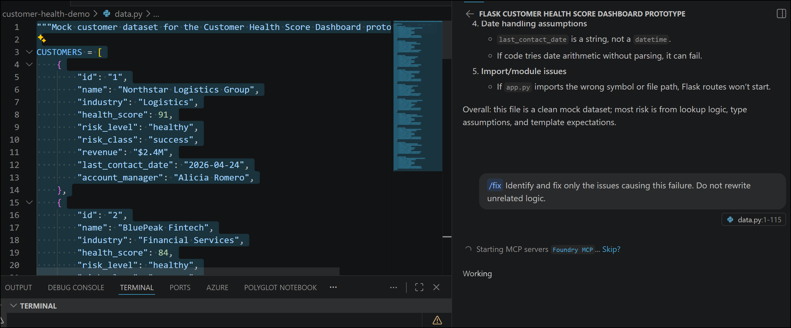

6.  **Common fixes needed:**

[TABLE]

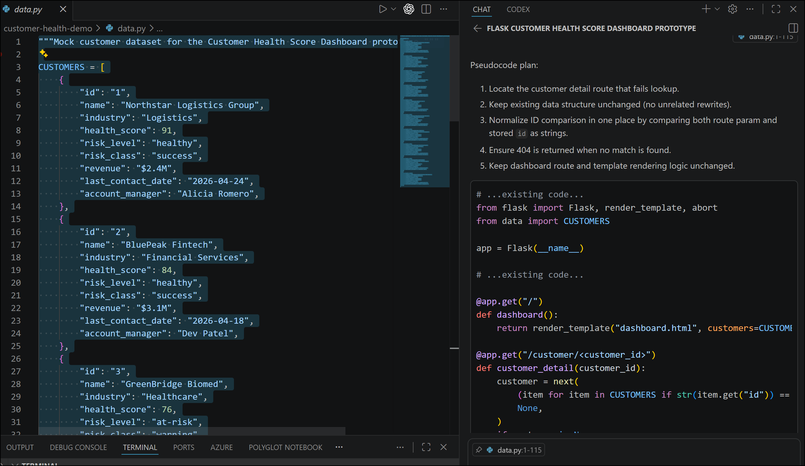

**Note:** On top of that, agent mode enables Copilot to quickly
recognize errors and fix them automatically.​ However, *visual* bugs
(wrong colors, layout issues) can't be auto-detected by Agent Mode
because it doesn't see the browser. **This is why human validation is
irreplaceable.**

## Task 5: Iterative Enhancement — Add a Feature with Edit Mode 

The VP will be more impressed if the dashboard shows a **summary
bar** at the top with key metrics. Let's add one using **Agent Mode**.

1\. In the Copilot Chat dropdown, select **Agent**.
Select **dashboard.html** and **app.py** to the **Working Set** (drag
the file tabs into the Edit panel).

**Prompt:**

Add a summary metrics bar at the top of the dashboard page, above the
table.

Show 4 Bootstrap cards in a row:

\- Total Customers (count)

\- Average Health Score (calculated from data, rounded to 1 decimal)

\- At-Risk Customers (count where risk_level is "at-risk" or "critical")

\- Total Revenue (sum of all customer revenue — parse from strings)

Calculate these metrics in app.py and pass them to the template.

Style the cards with Bootstrap's card component. Use a colored top
border:

blue for total, green for average score, orange for at-risk, purple for
revenue.

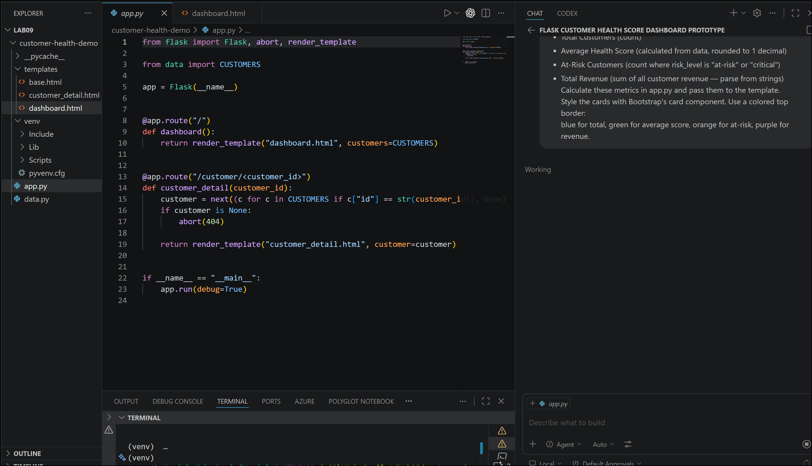

**2. Agent** Mode should show inline diffs in both app.py (new metric
calculations) and dashboard.html (new card row).

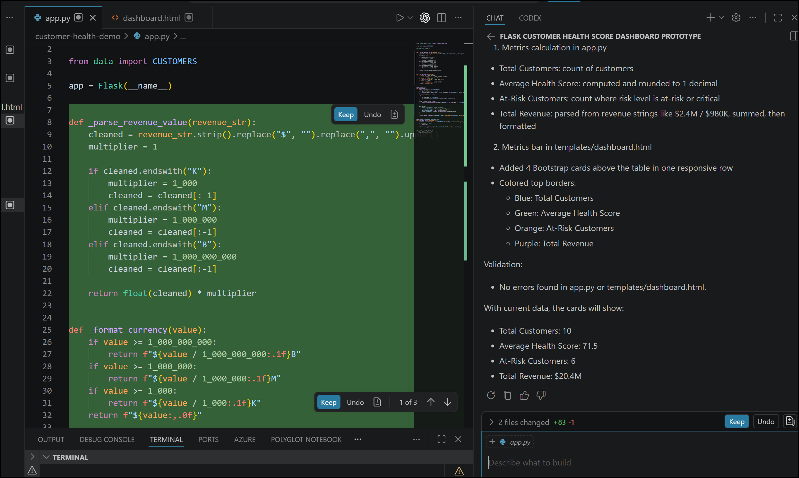

3\. If the revenue calculation looks wrong, **this is your moment to
exercise developer judgment:**

**Follow-up Edit Prompt:**

The revenue parsing is incorrect. Revenue strings are formatted like
"$1.2M"

or "$850K". Parse them by:

\- Removing the $ sign

\- Converting M to multiply by 1,000,000 and K to multiply by 1,000

\- Display total as formatted currency like "$12.5M"

Fix only the revenue parsing in app.py. Do not change other metrics.

5.  After accepting edits, **refresh the browser** and verify the
    metrics display correctly.

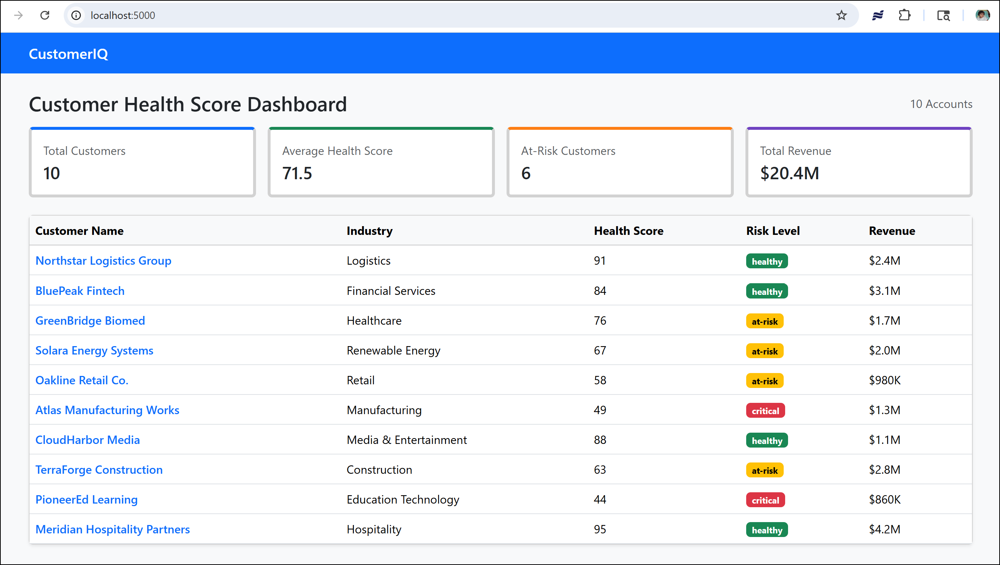

## Task 6: Document the Prototype with /doc 

1.  Select the **entire app.py** file. In Copilot Chat, type:

**Prompt — Documentation:**

/doc Generate clear documentation explaining this module's behavior.

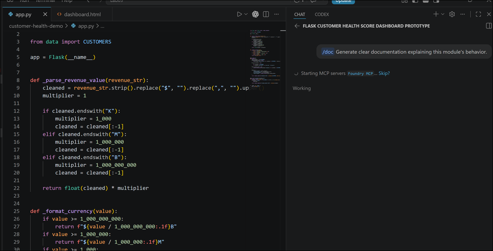

2.   Copilot should generate:

- A module-level docstring explaining the Customer Health Dashboard
  prototype

- Function-level docstrings for each route

- Parameter descriptions for the detail route's customer_id

/doc quickly generates documentation for a single method or entire file.
Best for quick, no-fuss documentation. May need edits for accuracy.​

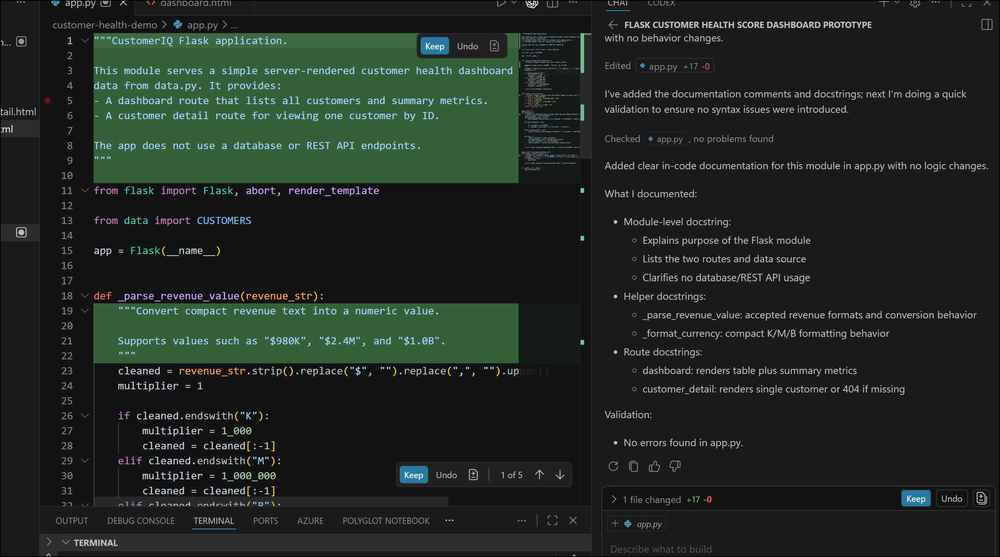
