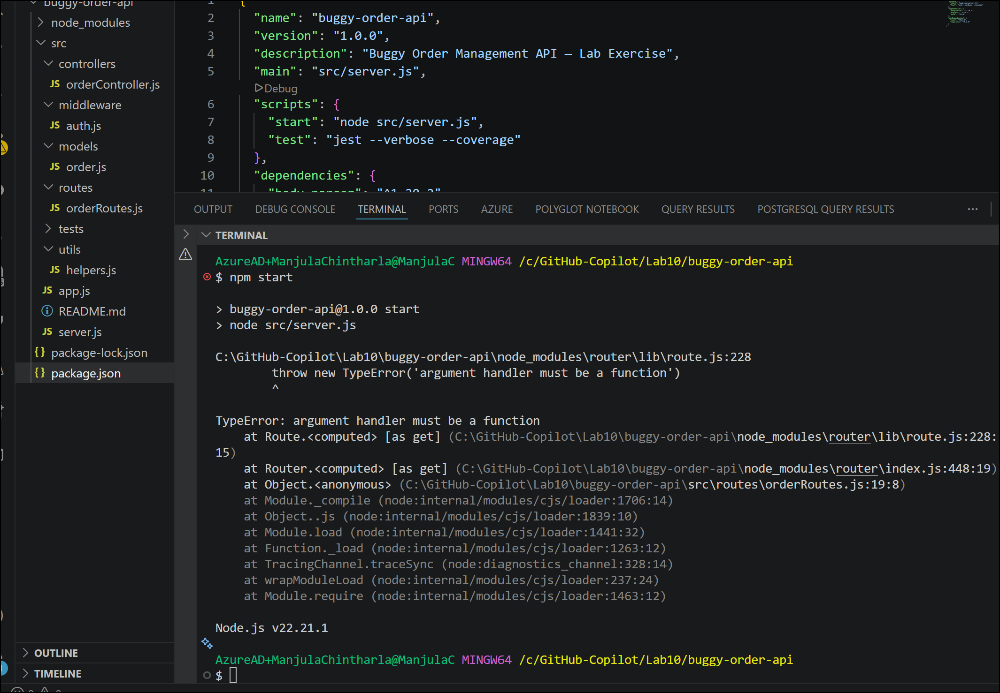
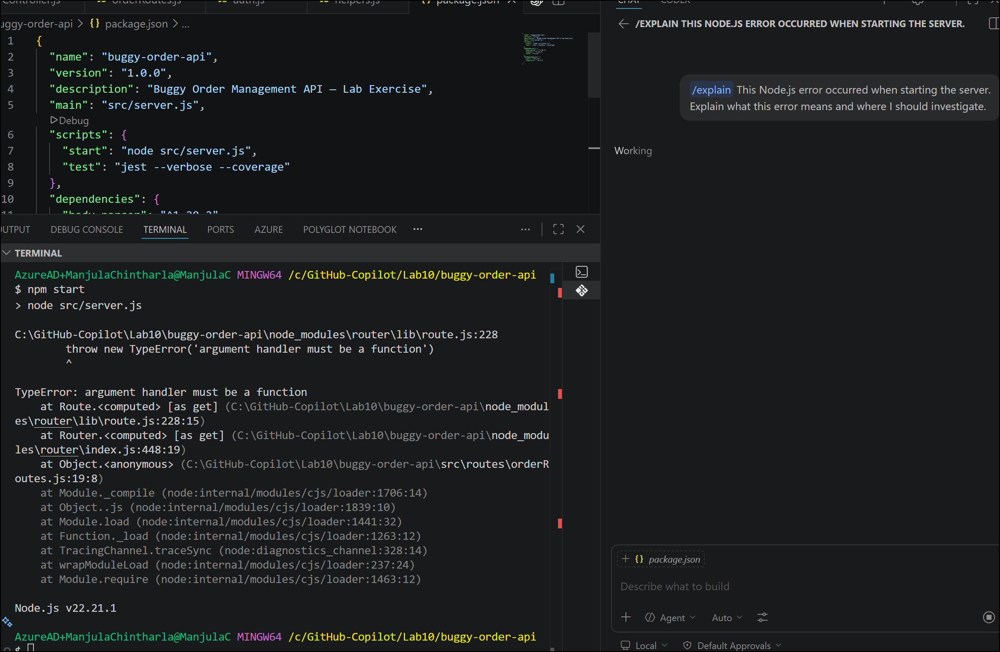

# Lab 10 - Debugging and fixing a buggy Node.js REST API with GitHub Copilot

**Scenario**

You have just joined a mid-size development team as a backend developer.
Your team lead has assigned you a **Node.js Express REST API** for an
e-commerce **Order Management System** that a junior developer built
before leaving the company. The API is riddled with bugs — it crashes on
certain endpoints, returns incorrect data, has security vulnerabilities,
lacks input validation, and has no unit tests.

Your task is to **use GitHub Copilot** as your AI pair-programming
assistant to systematically identify, understand, and fix all the bugs —
then add proper test coverage and documentation before the next sprint
review.

**This is NOT a coding fundamentals exercise.** You are expected to
understand JavaScript/Node.js. The lab teaches you **how to leverage
GitHub Copilot effectively** for real-world debugging workflows.

**Objectives**

By the end of this lab, you will be able to:

1.  Use **Copilot Chat** (/explain) to rapidly understand unfamiliar,
    buggy code

2.  Use **/fix** slash command to generate targeted bug fixes

3.  Write effective natural-language prompts to get Copilot to identify
    security vulnerabilities

4.  Use **/tests** to generate comprehensive unit tests for fixed code

5.  Use **/doc** to generate inline documentation

6.  Evaluate Copilot suggestions critically — accepting, modifying, or
    rejecting them

7.  Experience an end-to-end debugging workflow powered by GitHub
    Copilot

**Prerequisites / Setup**

**Environment Requirements**

[TABLE]

**Setup Instructions**

1.  **Create a new project folder:**

> mkdir buggy-order-api && cd buggy-order-api
>
> npm init -y

2.  **Install dependencies:**

> npm install express body-parser uuid

npm install --save-dev jest supertest

3.  **Create the project structure:**

4.  buggy-order-api/

5.  ├── src/

6.  │ ├── app.js

7.  │ ├── server.js

8.  │ ├── routes/

9.  │ │ └── orderRoutes.js

10. │ ├── controllers/

11. │ │ └── orderController.js

12. │ ├── models/

13. │ │ └── order.js

14. │ ├── middleware/

15. │ │ └── auth.js

16. │ └── utils/

17. │ └── helpers.js

18. ├── tests/

19. │ └── (empty - you'll generate these)

20. ├── package.json

21. └── README.md

22. **Copy the buggy code below** into the corresponding files.

**THE BUGGY APPLICATION CODE**

**File 1: src/app.js**

const express = require('express');

const bodyParser = require('body-parser');

const orderRoutes = require('./routes/orderRoutes');

const app = express();

// BUG \#1: bodyParser.json() is never called — request bodies will be
undefined

// BUG \#2: No CORS headers configured

app.use(bodyParser.urlencoded({ extended: true }));

// BUG \#3: Route prefix has a typo — "/api/v1/ordrs" instead of
"/api/v1/orders"

app.use('/api/v1/ordrs', orderRoutes);

// BUG \#4: Global error handler is missing — unhandled errors crash the
server

// (no error-handling middleware)

module.exports = app;

**File 2: src/server.js**

const app = require('./app');

// BUG \#5: Port is hardcoded and there's no fallback from environment
variable

const PORT = 3000;

// BUG \#6: No graceful shutdown handling

app.listen(PORT, () =\> {

console.log(\`Server running on port ${PORT}\`);

});

**File 3: src/models/order.js**

// In-memory data store (simulates a database)

let orders = \[\];

class Order {

constructor(customerName, items, shippingAddress) {

// BUG \#7: uuid is required but never imported

this.id = uuid.v4();

this.customerName = customerName;

this.items = items;

this.shippingAddress = shippingAddress;

// BUG \#8: Date is stored as string but formatted incorrectly

this.createdAt = Date.now; // Missing parentheses — stores function
reference, not timestamp

this.status = 'pending';

// BUG \#9: Total price is never calculated

this.totalPrice = 0;

}

static findAll() {

return orders;

}

static findById(id) {

// BUG \#10: Using == instead of === (loose equality)

// BUG \#11: Returns index instead of the order object

return orders.findIndex(order =\> order.id == id);

}

static create(orderData) {

const newOrder = new Order(

orderData.customerName,

orderData.items,

orderData.shippingAddress

);

orders.push(newOrder);

return newOrder;

}

static update(id, updateData) {

const orderIndex = orders.findIndex(order =\> order.id === id);

if (orderIndex === -1) return null;

// BUG \#12: Overwrites the entire order object instead of merging
properties

// This loses the order ID, createdAt, and other fields

orders\[orderIndex\] = updateData;

return orders\[orderIndex\];

}

static delete(id) {

const orderIndex = orders.findIndex(order =\> order.id === id);

if (orderIndex === -1) return false;

// BUG \#13: splice returns an array, but we want the single deleted
object

// Also, \`splice(orderIndex)\` without a second arg deletes everything
from that index onward

orders.splice(orderIndex);

return true;

}

static findByStatus(status) {

// BUG \#14: filter callback doesn't return anything (missing return /
arrow function issue)

return orders.filter(order =\> {

order.status === status;

});

}

// BUG \#15: No method to calculate order total

// BUG \#16: No method to validate order data before creation

}

module.exports = Order;

**File 4: src/controllers/orderController.js**

const Order = require('../models/order');

const orderController = {

// GET all orders

getAllOrders: (req, res) =\> {

try {

const orders = Order.findAll();

// BUG \#17: Always returns 200 even if orders array is empty — should
differentiate

res.status(200).json(orders);

} catch (error) {

// BUG \#18: Sends error object directly — may expose sensitive stack
trace info

res.status(500).json({ error: error });

}

},

// GET order by ID

getOrderById: (req, res) =\> {

try {

const order = Order.findById(req.params.id);

// BUG \#19: findById returns an index (number), not an order object

// Checking \`if (!order)\` won't catch index 0 (falsy) — will return
"not found" for first order

if (!order) {

return res.status(404).json({ message: 'Order not found' });

}

res.status(200).json(order);

} catch (error) {

res.status(500).json({ error: error.message });

}

},

// POST create new order

createOrder: (req, res) =\> {

try {

// BUG \#20: No input validation at all — customerName, items, address
could be undefined/empty

const { customerName, items, shippingAddress } = req.body;

// BUG \#21: req.body will be undefined because bodyParser.json() was
never added

const newOrder = Order.create({

customerName,

items,

shippingAddress

});

// BUG \#22: Returns 200 instead of 201 for resource creation

res.status(200).json({

message: 'Order created successfully',

order: newOrder

});

} catch (error) {

// BUG \#23: Returns 400 for what could be a server error

res.status(400).json({ error: error.message });

}

},

// PUT update order

updateOrder: (req, res) =\> {

try {

const { id } = req.params;

const updateData = req.body;

// BUG \#24: No check for empty update body

const updatedOrder = Order.update(id, updateData);

if (!updatedOrder) {

return res.status(404).json({ message: 'Order not found' });

}

// BUG \#25: Returns the broken updated order (which lost all its
original fields)

res.status(200).json({

message: 'Order updated successfully',

order: updatedOrder

});

} catch (error) {

res.status(500).json({ error: error.message });

}

},

// DELETE order

deleteOrder: (req, res) =\> {

try {

const { id } = req.params;

const deleted = Order.delete(id);

if (!deleted) {

return res.status(404).json({ message: 'Order not found' });

}

// BUG \#26: Returns 200 instead of 204 (No Content) for successful
delete

// Also sends a body with 204 which some clients ignore

res.status(200).json({ message: 'Order deleted successfully' });

} catch (error) {

res.status(500).json({ error: error.message });

}

},

// GET orders by status

getOrdersByStatus: (req, res) =\> {

try {

// BUG \#27: reads \`req.params.status\` but the route uses query params
\`req.query.status\`

const { status } = req.params;

// BUG \#28: No validation for allowed status values

const orders = Order.findByStatus(status);

res.status(200).json(orders);

} catch (error) {

res.status(500).json({ error: error.message });

}

},

// GET order summary/analytics

getOrderSummary: (req, res) =\> {

try {

const orders = Order.findAll();

// BUG \#29: reduce has no initial value — crashes on empty array

const totalRevenue = orders.reduce((sum, order) =\> sum +
order.totalPrice);

// BUG \#30: \`length\` is called as a method instead of a property

const summary = {

totalOrders: orders.length(),

totalRevenue: totalRevenue,

// BUG \#31: \`pending\` is not in quotes — ReferenceError

pendingOrders: orders.filter(o =\> o.status === pending).length,

completedOrders: orders.filter(o =\> o.status === 'completed').length

};

res.status(200).json(summary);

} catch (error) {

res.status(500).json({ error: error.message });

}

}

};

module.exports = orderController;

**File 5: src/routes/orderRoutes.js**

const express = require('express');

const router = express.Router();

const orderController = require('../controllers/orderController');

const auth = require('../middleware/auth');

// BUG \#32: GET and POST are swapped — GET should retrieve, POST should
create

router.post('/', orderController.getAllOrders);

router.get('/', orderController.createOrder);

// BUG \#33: Route parameter uses \`:orderId\` but controller reads
\`req.params.id\`

router.get('/:orderId', orderController.getOrderById);

router.put('/:orderId', auth.verifyToken, orderController.updateOrder);

router.delete('/:orderId', auth.verifyToken,
orderController.deleteOrder);

// BUG \#34: This route conflicts with \`/:orderId\` — Express will
match "status" as an orderId

router.get('/status', orderController.getOrdersByStatus);

// BUG \#35: Summary route is defined but uses wrong controller method
name

router.get('/summary', orderController.orderSummary);

module.exports = router;

**File 6: src/middleware/auth.js**

const auth = {

verifyToken: (req, res, next) =\> {

// BUG \#36: Header name is case-sensitive check — should be lowercase

const token = req.headers\['Authorization'\];

if (!token) {

// BUG \#37: Returns 403 (Forbidden) instead of 401 (Unauthorized) when
no token

return res.status(403).json({ message: 'No token provided' });

}

// BUG \#38: Token "validation" just checks if it exists — no actual
verification

// This is a major security vulnerability

if (token === 'undefined' || token === 'null') {

return res.status(401).json({ message: 'Invalid token' });

}

// BUG \#39: Sets req.user but never extracts user info from token

req.user = { authenticated: true };

next();

}

};

module.exports = auth;

**File 7: src/utils/helpers.js**

const helpers = {

// BUG \#40: Price calculation has floating point issues and doesn't
handle edge cases

calculateTotal: (items) =\> {

let total = 0;

// BUG \#41: for...in loop on array iterates over indices/properties,
not values

for (let item in items) {

// BUG \#42: Multiplies price by itself instead of price \* quantity

total += item.price \* item.price;

}

return total;

},

// BUG \#43: Validation function always returns true (logic is inverted)

validateOrderData: (data) =\> {

if (!data.customerName || data.customerName.trim() === '') {

return true; // Should return false

}

if (!data.items || !Array.isArray(data.items) || data.items.length ===
0) {

return true; // Should return false

}

if (!data.shippingAddress || data.shippingAddress.trim() === '') {

return true; // Should return false

}

return false; // Should return true

},

// BUG \#44: Status validation has typo in valid statuses array

isValidStatus: (status) =\> {

const validStatuses = \['pending', 'processing', 'shiped', 'delivered',
'cancled'\];

// BUG \#45: includes() is case-sensitive but no toLowerCase() is
applied

return validStatuses.includes(status);

},

// BUG \#46: Pagination helper has off-by-one error

paginate: (array, page, limit) =\> {

// BUG \#47: page starts from 0 in calculation but users expect page 1
to be first

const startIndex = page \* limit;

// BUG \#48: slice end index is wrong — should be startIndex + limit

const endIndex = startIndex + limit - 1;

return array.slice(startIndex, endIndex);

},

// BUG \#49: Doesn't sanitize inputs — vulnerable to XSS

formatOrderResponse: (order) =\> {

return {

id: order.id,

customer: order.customerName,

items: order.items,

total: order.totalPrice,

status: order.status,

// BUG \#50: Tries to call toISOString() on a function reference (from
Bug \#8)

created: order.createdAt.toISOString()

};

}

};

module.exports = helpers;

**File 8: package.json (update the scripts section)**

{

"name": "buggy-order-api",

"version": "1.0.0",

"description": "Buggy Order Management API — Lab Exercise",

"main": "src/server.js",

"scripts": {

"start": "node src/server.js",

"test": "jest --verbose --coverage"

},

"dependencies": {

"body-parser": "^1.20.2",

"express": "^4.18.2",

"uuid": "^9.0.0"

},

"devDependencies": {

"jest": "^29.7.0",

"supertest": "^6.3.3"

}

}

## Task 1: Understand the Problem (Human Reasoning First)

Before using Copilot, assess the situation as a developer.

1.  pen the project in VS Code.

2.  Open terminal and start the server:

> npm start

3.  You will likely see a **crash** 

> 

4.  **Write down** what you observe:

    - Does the server start?

    - What error messages do you see?

    - Which endpoints seem broken?

Before asking Copilot anything, you should form your own hypothesis.
Copilot is an assistant, not a replacement for your reasoning.

## Task 2: Use GitHub Copilot to analyze and explore the codebase

1.  Use Copilot Chat as an interactive AI assistant, helping you debug
    issues with natural language queries.​

&nbsp;

1.  Open Copilot Chat and enter below prompt

/explain This Node.js error occurred when starting the server.

Explain what this error means and where I should investigate.

> 

2.  Read Copilot's explanation carefully. It should identify:

    - Missing uuid import

    - Date.now vs Date.now()

    - findById returning index instead of object

    - splice misuse

 **What to look for:** Use /explain for a step-by-step breakdown of a
complex function.​ Does Copilot catch ALL the bugs? Note which ones it
misses — this is where developer expertise matters.

**Task 2.2 — Ask Copilot About Specific Suspicious Code**

1.  Highlight the findByStatus method in order.js.

2.  In Copilot Chat, ask:

3.  Why does this filter method always return an empty array?

4.  Copilot should explain that the arrow function body with curly
    braces needs an explicit return statement, or the curly braces
    should be removed.

**Task 2.3 — Ask Copilot to Identify Security Issues**

1.  Open src/middleware/auth.js.

2.  In Copilot Chat, type:

3.  Analyze this authentication middleware for security vulnerabilities
    and best practice violations

4.  **Evaluate Copilot's response.** It should identify:

    - No actual token verification (JWT or otherwise)

    - Wrong HTTP status code (403 vs 401)

    - Case-sensitive header access

    - No user info extraction from token

**Developer Decision Point:** Copilot may suggest implementing full JWT
verification. For this lab, decide whether a simple token check is
sufficient for a prototype or if you should implement proper JWT. **This
is your call, not Copilot's.**

## Task 2 : Use Copilot to Generate Fixes — File by File

 Use the /fix command as a go-to tool for resolving code issues by
allowing you to highlight a block of problematic code or describe an
error

** Lab: Debugging and Fixing a Buggy Node.js REST API with GitHub
Copilot**

***(COMPLETE ENHANCED VERSION — Full Steps 3–8 + Additional Lab
Enhancements)***

------------------------------------------------------------------------

**🆕 ENHANCED LAB ADDITIONS**

**📦 A. GitHub Repository Clone Setup (For Lab Providers)**

**Lab Provider Note:** As a lab provider, you will host the buggy
application in a pre-configured GitHub repository. Students will clone
this repo as their starting point.

Add the following to the **Prerequisites / Setup** section at the very
beginning of the lab:

------------------------------------------------------------------------

**Repository Setup Instructions**

1.  **Clone the lab starter repository:**

> git clone https://github.com/\<your-org\>/buggy-order-api-lab.git
>
> cd buggy-order-api-lab

2.  **Install dependencies:**

> npm install

3.  **Verify the project structure:**

> buggy-order-api-lab/
>
> ├── src/
>
> │ ├── app.js \# Express app configuration (contains bugs)
>
> │ ├── server.js \# Server entry point (contains bugs)
>
> │ ├── routes/
>
> │ │ └── orderRoutes.js \# Route definitions (contains bugs)
>
> │ ├── controllers/
>
> │ │ └── orderController.js \# Request handlers (contains bugs)
>
> │ ├── models/
>
> │ │ └── order.js \# Data model (contains bugs)
>
> │ ├── middleware/
>
> │ │ └── auth.js \# Auth middleware (contains bugs)
>
> │ └── utils/
>
> │ └── helpers.js \# Utility functions (contains bugs)
>
> ├── tests/ \# Empty — you will generate tests
>
> ├── docs/
>
> │ └── BUG-TRACKER.md \# Bug tracking checklist
>
> ├── .github/
>
> │ └── copilot-instructions.md \# Custom Copilot instructions
>
> ├── package.json
>
> └── README.md

4.  **Try to start the application (it will crash!):**

> npm start

5.  **Create a new branch for your fixes:**

> git checkout -b fix/debug-with-copilot

💡 **Why clone a repo?** This simulates the real-world scenario of
inheriting a codebase from another developer — exactly the kind of
situation where GitHub Copilot shines.

## Task 4 Bug Tracker Checklist (docs/BUG-TRACKER.md)

Include this file in the repo so students can track their progress:

\# 🐛 Bug Tracker Checklist

Track your progress as you identify and fix bugs using GitHub Copilot.

\## Legend

\- ⬜ = Not started

\- 🔍 = Identified with Copilot

\- 🔧 = Fix applied

\- ✅ = Tested & verified

\## App Configuration Bugs (app.js / server.js)

| \# | Bug Description | Severity | Status | Copilot Feature Used |

|---|----------------|----------|--------|---------------------|

| 1 | bodyParser.json() never called | 🔴 Critical | ⬜ | |

| 2 | No CORS headers configured | 🟡 Medium | ⬜ | |

| 3 | Route prefix typo "/ordrs" | 🔴 Critical | ⬜ | |

| 4 | Missing global error handler | 🟡 Medium | ⬜ | |

| 5 | Port hardcoded, no env fallback | 🟢 Low | ⬜ | |

| 6 | No graceful shutdown handling | 🟢 Low | ⬜ | |

\## Data Model Bugs (order.js)

| \# | Bug Description | Severity | Status | Copilot Feature Used |

|---|----------------|----------|--------|---------------------|

| 7 | uuid not imported | 🔴 Critical | ⬜ | |

| 8 | Date.now missing parentheses | 🔴 Critical | ⬜ | |

| 9 | Total price never calculated | 🟡 Medium | ⬜ | |

| 10 | Loose equality (== vs ===) | 🟡 Medium | ⬜ | |

| 11 | findById returns index not object | 🔴 Critical | ⬜ | |

| 12 | update() overwrites entire object | 🔴 Critical | ⬜ | |

| 13 | splice() misuse in delete() | 🔴 Critical | ⬜ | |

| 14 | filter callback missing return | 🔴 Critical | ⬜ | |

| 15 | No calculateTotal method | 🟡 Medium | ⬜ | |

| 16 | No data validation method | 🟡 Medium | ⬜ | |

\## Controller Bugs (orderController.js)

| \# | Bug Description | Severity | Status | Copilot Feature Used |

|---|----------------|----------|--------|---------------------|

| 17 | No empty-array differentiation | 🟢 Low | ⬜ | |

| 18 | Exposes error stack trace | 🟡 Medium | ⬜ | |

| 19 | getOrderById uses index (falsy 0) | 🔴 Critical | ⬜ | |

| 20 | No input validation on create | 🟡 Medium | ⬜ | |

| 21 | req.body undefined (from Bug \#1) | 🔴 Critical | ⬜ | |

| 22 | Returns 200 instead of 201 | 🟡 Medium | ⬜ | |

| 23 | Wrong error status code | 🟢 Low | ⬜ | |

| 24 | No check for empty update body | 🟡 Medium | ⬜ | |

| 25 | Broken update returns bad data | 🔴 Critical | ⬜ | |

| 26 | Returns 200 instead of 204 on delete | 🟢 Low | ⬜ | |

| 27 | Uses req.params instead of req.query | 🔴 Critical | ⬜ | |

| 28 | No status value validation | 🟡 Medium | ⬜ | |

| 29 | reduce() no initial value | 🔴 Critical | ⬜ | |

| 30 | .length() called as method | 🔴 Critical | ⬜ | |

| 31 | \`pending\` not in quotes | 🔴 Critical | ⬜ | |

\## Route Bugs (orderRoutes.js)

| \# | Bug Description | Severity | Status | Copilot Feature Used |

|---|----------------|----------|--------|---------------------|

| 32 | GET and POST swapped | 🔴 Critical | ⬜ | |

| 33 | :orderId vs :id param mismatch | 🔴 Critical | ⬜ | |

| 34 | /status conflicts with /:orderId | 🟡 Medium | ⬜ | |

| 35 | Wrong controller method name | 🔴 Critical | ⬜ | |

\## Middleware Bugs (auth.js)

| \# | Bug Description | Severity | Status | Copilot Feature Used |

|---|----------------|----------|--------|---------------------|

| 36 | Case-sensitive header access | 🟡 Medium | ⬜ | |

| 37 | Returns 403 instead of 401 | 🟡 Medium | ⬜ | |

| 38 | No actual token verification | 🔴 Critical | ⬜ | |

| 39 | No user info extracted from token | 🟡 Medium | ⬜ | |

\## Utility Bugs (helpers.js)

| \# | Bug Description | Severity | Status | Copilot Feature Used |

|---|----------------|----------|--------|---------------------|

| 40 | Floating point price issues | 🟡 Medium | ⬜ | |

| 41 | for...in on array | 🔴 Critical | ⬜ | |

| 42 | price \* price instead of price \* quantity | 🔴 Critical | ⬜ |
|

| 43 | Validation logic inverted | 🔴 Critical | ⬜ | |

| 44 | Typo in status values array | 🟡 Medium | ⬜ | |

| 45 | Case-sensitive includes() | 🟡 Medium | ⬜ | |

| 46 | Pagination off-by-one error | 🟡 Medium | ⬜ | |

| 47 | Page starts from 0 not 1 | 🟡 Medium | ⬜ | |

| 48 | Slice end index wrong | 🟡 Medium | ⬜ | |

| 49 | No input sanitization (XSS risk) | 🟡 Medium | ⬜ | |

| 50 | toISOString() on function reference | 🔴 Critical | ⬜ | |

---

\*\*Total Bugs: 50\*\* | 🔴 Critical: 24 | 🟡 Medium: 20 | 🟢 Low: 6

------------------------------------------------------------------------

## Task 5 : Custom Copilot Instructions File (.github/copilot-instructions.md)

Include this in the repo to teach students about custom instructions —
file-based custom instructions that let you document code-specific
conventions for GitHub Copilot in your workspace or repository, and chat
conversations automatically include this file if it is present in the
workspace.​[**1**](https://github.blog/changelog/2024-10-29-multi-file-editing-code-review-custom-instructions-and-more-for-github-copilot-in-vs-code-october-release-v0-22/)​

\# Copilot Instructions for This Project

\## Project Context

This is a Node.js Express REST API for Order Management.

We use an in-memory data store (no database).

The project uses Jest for testing and Supertest for HTTP assertions.

\## Coding Standards

\- Use strict equality (===) instead of loose equality (==)

\- Always validate inputs before processing

\- Use proper HTTP status codes (201 for creation, 204 for deletion, 401
for unauthorized)

\- Handle errors with try-catch and return meaningful error messages

\- Never expose stack traces in API responses

\- Use arrow functions with explicit returns in array methods

\- Use \`const\` by default, \`let\` only when reassignment is needed

\- Add JSDoc comments to all exported functions

\## Security Requirements

\- Validate and sanitize all user inputs

\- Use proper authentication middleware

\- Set appropriate CORS headers

\- Never trust client-side data without validation

------------------------------------------------------------------------

## Task 3 : Use Copilot to Generate Fixes — File by File (COMPLETE)

**Objective:** Systematically fix each file using
Copilot's /fix command, inline suggestions, and Copilot Chat prompts.
Select the code causing issues, type /fix, and let Copilot Chat generate
suggestions.​[**2**](https://github.blog/ai-and-ml/github-copilot/how-to-debug-code-with-github-copilot/)​

------------------------------------------------------------------------

**🔧 Task 3.1 — Fix src/app.js (Bugs \#1–#4)**

1.  **Open** src/app.js in the editor.

2.  **Select all code** in the file and type in Copilot Chat:

3.  /fix Review this Express app configuration. It is missing critical
    middleware

4.  and has a route prefix typo. Fix all issues.

5.  **Review Copilot's suggestions.** It should propose:

    - Adding app.use(bodyParser.json()); before routes

    - Adding CORS middleware (either cors package or manual headers)

    - Fixing '/api/v1/ordrs' → '/api/v1/orders'

    - Adding a global error-handling middleware at the bottom

6.  **Expected fixed code:**

> const express = require('express');
>
> const bodyParser = require('body-parser');
>
> const cors = require('cors');
>
> const orderRoutes = require('./routes/orderRoutes');
>
> const app = express();
>
> // Middleware
>
> app.use(cors());
>
> app.use(bodyParser.json());
>
> app.use(bodyParser.urlencoded({ extended: true }));
>
> // Routes
>
> app.use('/api/v1/orders', orderRoutes);
>
> // Global error handler
>
> app.use((err, req, res, next) =\> {
>
> console.error(err.stack);
>
> res.status(500).json({
>
> message: 'Internal Server Error',
>
> error: process.env.NODE_ENV === 'development' ? err.message :
> undefined
>
> });
>
> });
>
> module.exports = app;

7.  **Install the CORS package if Copilot suggested it:**

> npm install cors

8.  **Update your Bug Tracker:** Mark Bugs \#1–#4 as 🔧 and note which
    Copilot feature you used.

⚠️ **Developer Judgment:** Copilot may suggest various CORS
configurations. For a development API, permissive CORS is fine. For
production, you'd restrict origins. **This decision is yours**, not
Copilot's.

------------------------------------------------------------------------

**🔧 Task 3.2 — Fix src/server.js (Bugs \#5–#6)**

1.  **Open** src/server.js.

2.  **Select all code** and use Copilot Chat:

3.  /fix This server file has a hardcoded port and no graceful shutdown.

4.  Add environment variable support and proper signal handling.

5.  **Review and apply.** Expected fixed code:

> const app = require('./app');
>
> const PORT = process.env.PORT || 3000;
>
> const server = app.listen(PORT, () =\> {
>
> console.log(\`Server running on port ${PORT}\`);
>
> console.log(\`Environment: ${process.env.NODE_ENV ||
> 'development'}\`);
>
> });
>
> // Graceful shutdown
>
> const shutdown = (signal) =\> {
>
> console.log(\`\n${signal} received. Shutting down gracefully...\`);
>
> server.close(() =\> {
>
> console.log('Server closed.');
>
> process.exit(0);
>
> });
>
> // Force shutdown after 10 seconds
>
> setTimeout(() =\> {
>
> console.error('Forced shutdown due to timeout.');
>
> process.exit(1);
>
> }, 10000);
>
> };

6.  

7.  process.on('SIGTERM', () =\> shutdown('SIGTERM'));

8.  process.on('SIGINT', () =\> shutdown('SIGINT'));

9.  **Update Bug Tracker:** Mark Bugs \#5–#6 as 🔧.

------------------------------------------------------------------------

**🔧 Task 3.3 — Fix src/models/order.js (Bugs \#7–#16) — The Most
Critical File**

This file contains **10 bugs** and is the core of the application. We'll
fix it in stages.

**Stage A: Fix Critical Crashes (Bugs \#7, \#8)**

1.  **Highlight the constructor** of the Order class.

2.  In Copilot Chat:

3.  /fix This constructor crashes because uuid is never imported and
    Date.now

4.  is missing parentheses. Also, totalPrice should be calculated from
    items.

5.  **Verify** Copilot adds const { v4: uuidv4 } = require('uuid'); at
    the top and changes Date.now to Date.now() or new Date().

**Stage B: Fix findById (Bugs \#10, \#11)**

1.  **Highlight** the findById method.

2.  In Copilot Chat:

> /fix This method returns findIndex (a number) instead of the actual
> object.
>
> Also, it uses loose equality. Fix it to return the order object using
> strict equality.
>
> **Expected fix:**
>
> static findById(id) {
>
> return orders.find(order =\> order.id === id);
>
> }

**Stage C: Fix update Method (Bug \#12)**

1.  **Highlight** the update method.

2.  Use **inline chat** (press Ctrl+I / Cmd+I on the selection):

3.  Fix this: it overwrites the entire order with updateData, losing the
    original

4.  fields like id and createdAt. It should merge properties instead.

5.  **Expected fix:**

> static update(id, updateData) {
>
> const orderIndex = orders.findIndex(order =\> order.id === id);
>
> if (orderIndex === -1) return null;
>
> // Merge while preserving id and createdAt
>
> orders\[orderIndex\] = {
>
> ...orders\[orderIndex\],
>
> ...updateData,
>
> id: orders\[orderIndex\].id, // Never allow ID override
>
> createdAt: orders\[orderIndex\].createdAt // Preserve creation
> timestamp
>
> };
>
> return orders\[orderIndex\];
>
> }

**Stage D: Fix delete Method (Bug \#13)**

1.  **Highlight** the delete method.

2.  In Copilot Chat:

3.  /fix The splice call is missing the second argument (deleteCount).

4.  splice(index) without a count deletes everything from that index
    onward.

5.  Fix it to delete only one element.

6.  **Expected fix:**

> static delete(id) {
>
> const orderIndex = orders.findIndex(order =\> order.id === id);
>
> if (orderIndex === -1) return false;
>
> orders.splice(orderIndex, 1);
>
> return true;
>
> }

**Stage E: Fix findByStatus (Bug \#14)**

1.  **Highlight** the findByStatus method.

2.  Ask Copilot Chat:

3.  Why does this filter callback never return any results? Fix it.

4.  **Expected fix:**

> static findByStatus(status) {
>
> return orders.filter(order =\> order.status === status);
>
> }

📌 **Learning Point:** The bug was curly braces without
a return statement. Copilot should explain that =\> { expression
} needs return, while =\> expression returns implicitly.

**Stage F: Add Missing Methods (Bugs \#15, \#16)**

1.  Place your cursor at the bottom of the class, **before the
    closing }**.

2.  Type the following **comment prompt** to trigger Copilot inline
    suggestions:

3.  // Calculate the total price of an order by summing price \*
    quantity for each item

4.  **Wait for Copilot's ghost text suggestion** and press Tab to accept
    if it looks correct.

5.  Then type another comment:

6.  // Validate order data: customerName, items (non-empty array), and
    shippingAddress are required

7.  Accept or refine Copilot's suggestion.

8.  **Update Bug Tracker:** Mark Bugs \#7–#16 as 🔧.

------------------------------------------------------------------------

**🔧 Task 3.4 — Fix src/controllers/orderController.js (Bugs \#17–#31)**

**Stage A: Fix createOrder (Bugs \#20–#23)**

1.  **Highlight** the createOrder method.

2.  In Copilot Chat:

3.  /fix This createOrder method has no input validation, returns wrong
    HTTP

4.  status code (200 instead of 201), and has incorrect error handling.

5.  Fix all issues and add proper validation using the helpers module.

6.  **Review** Copilot's output. Expected improvements:

    - Import helpers at the top

    - Validate customerName, items, shippingAddress before creating

    - Return 201 status code

    - Proper error handling with 500 for server errors

7.  **Expected fixed code:**

> createOrder: (req, res) =\> {
>
> try {
>
> const { customerName, items, shippingAddress } = req.body;
>
> // Input validation
>
> if (!customerName || !items || !Array.isArray(items) || items.length
> === 0 || !shippingAddress) {
>
> return res.status(400).json({
>
> message: 'Validation failed',
>
> required: \['customerName', 'items (non-empty array)',
> 'shippingAddress'\]
>
> });
>
> }
>
> const newOrder = Order.create({ customerName, items, shippingAddress
> });
>
> res.status(201).json({
>
> message: 'Order created successfully',
>
> order: newOrder
>
> });
>
> } catch (error) {
>
> res.status(500).json({ message: 'Failed to create order', error:
> error.message });
>
> }
>
> },

**Stage B: Fix getOrderById (Bug \#19)**

1.  **Highlight** the getOrderById method.

2.  Use **inline chat** (Ctrl+I):

3.  The model's findById now returns an order object or undefined.

4.  Fix this handler to properly check for null/undefined instead of
    falsy values.

5.  **Expected fix:**

> getOrderById: (req, res) =\> {
>
> try {
>
> const order = Order.findById(req.params.id);
>
> if (!order) {
>
> return res.status(404).json({ message: 'Order not found' });
>
> }
>
> res.status(200).json(order);
>
> } catch (error) {
>
> res.status(500).json({ message: 'Failed to retrieve order', error:
> error.message });
>
> }
>
> },

**Stage C: Fix getOrdersByStatus (Bugs \#27–#28)**

1.  **Highlight** the getOrdersByStatus method.

2.  In Copilot Chat:

3.  /fix This reads status from req.params but the route sends it as a
    query

4.  parameter. Also add validation for allowed status values:

5.  pending, processing, shipped, delivered, cancelled.

6.  **Expected fix:**

> getOrdersByStatus: (req, res) =\> {
>
> try {
>
> const { status } = req.query;
>
> const validStatuses = \['pending', 'processing', 'shipped',
> 'delivered', 'cancelled'\];
>
> if (!status || !validStatuses.includes(status.toLowerCase())) {
>
> return res.status(400).json({
>
> message: 'Invalid or missing status parameter',
>
> validStatuses
>
> });
>
> }
>
> const orders = Order.findByStatus(status.toLowerCase());
>
> res.status(200).json(orders);
>
> } catch (error) {
>
> res.status(500).json({ message: 'Failed to retrieve orders', error:
> error.message });
>
> }
>
> },

**Stage D: Fix getOrderSummary (Bugs \#29–#31)**

1.  **Highlight** the getOrderSummary method.

2.  In Copilot Chat:

3.  /fix This method has three bugs:

4.  1\. reduce() crashes on empty array (no initial value)

5.  2\. .length() is called as a method instead of a property

6.  3\. 'pending' is not in quotes - it's a ReferenceError

7.  Fix all three.

8.  **Expected fix:**

> getOrderSummary: (req, res) =\> {
>
> try {
>
> const orders = Order.findAll();
>
> const totalRevenue = orders.reduce((sum, order) =\> sum +
> order.totalPrice, 0);
>
> const summary = {
>
> totalOrders: orders.length,
>
> totalRevenue: totalRevenue,
>
> pendingOrders: orders.filter(o =\> o.status === 'pending').length,
>
> completedOrders: orders.filter(o =\> o.status === 'completed').length,
>
> processingOrders: orders.filter(o =\> o.status ===
> 'processing').length
>
> };
>
> res.status(200).json(summary);
>
> } catch (error) {
>
> res.status(500).json({ message: 'Failed to generate summary', error:
> error.message });
>
> }
>
> }
>
> **Update Bug Tracker:** Mark Bugs \#17–#31 as 🔧.

------------------------------------------------------------------------

**🔧 Task 3.5 — Fix src/routes/orderRoutes.js (Bugs \#32–#35)**

1.  **Open** orderRoutes.js and **select all code**.

2.  In Copilot Chat, use a comprehensive prompt:

3.  /fix This route file has the following issues:

4.  1\. GET and POST methods are swapped on the root route

5.  2\. Route parameter is :orderId but controllers expect :id

6.  3\. /status route conflicts with /:orderId pattern (Express matches
    "status" as an orderId)

7.  4\. Summary route references wrong controller method name
    (orderSummary vs getOrderSummary)

8.  Fix all issues and ensure route ordering prevents conflicts.

9.  **Expected fixed code:**

> const express = require('express');
>
> const router = express.Router();
>
> const orderController = require('../controllers/orderController');
>
> const auth = require('../middleware/auth');
>
> // Static routes MUST come before parameterized routes
>
> router.get('/status', orderController.getOrdersByStatus);
>
> router.get('/summary', orderController.getOrderSummary);
>
> // CRUD routes
>
> router.get('/', orderController.getAllOrders);
>
> router.post('/', orderController.createOrder);
>
> // Parameterized routes
>
> router.get('/:id', orderController.getOrderById);
>
> router.put('/:id', auth.verifyToken, orderController.updateOrder);
>
> router.delete('/:id', auth.verifyToken, orderController.deleteOrder);
>
> module.exports = router;

🧠 **Developer Judgment:** Notice how route ordering matters in Express.
Copilot is recognizing patterns and suggesting solutions based on what
it has
learned.​[**2**](https://github.blog/ai-and-ml/github-copilot/how-to-debug-code-with-github-copilot/)​
But understanding **why** /status must come before /:id requires your
knowledge of Express route matching.

1.  **Update Bug Tracker:** Mark Bugs \#32–#35 as 🔧.

------------------------------------------------------------------------

**🔧 Task 3.6 — Fix src/middleware/auth.js (Bugs \#36–#39)**

1.  **Open** auth.js and **select all code**.

> In Copilot Chat:
>
> /fix This auth middleware has security issues:
>
> 1\. req.headers\['Authorization'\] should be lowercase 'authorization'
>
> 2\. Returns 403 when it should return 401 (no token = unauthorized,
> not forbidden)
>
> 3\. No actual token verification — just checks if token exists
>
> 4\. Never extracts user info from token
>
> Implement proper JWT token verification using jsonwebtoken library.
>
> **Expected fixed code:**
>
> const jwt = require('jsonwebtoken');
>
> const JWT_SECRET = process.env.JWT_SECRET ||
> 'your-secret-key-change-in-production';
>
> const auth = {
>
> verifyToken: (req, res, next) =\> {
>
> const authHeader = req.headers\['authorization'\];
>
> if (!authHeader) {
>
> return res.status(401).json({ message: 'No token provided.
> Authorization denied.' });
>
> }
>
> // Extract token from "Bearer \<token\>" format
>
> const token = authHeader.startsWith('Bearer ')
>
> ? authHeader.slice(7)
>
> : authHeader;
>
> if (!token || token === 'undefined' || token === 'null') {
>
> return res.status(401).json({ message: 'Invalid token format.' });
>
> }
>
> try {
>
> const decoded = jwt.verify(token, JWT_SECRET);
>
> req.user = decoded;
>
> next();
>
> } catch (error) {
>
> return res.status(401).json({ message: 'Token is not valid or has
> expired.' });
>
> }
>
> },
>
> // Helper to generate tokens (for testing)
>
> generateToken: (payload) =\> {
>
> return jwt.sign(payload, JWT_SECRET, { expiresIn: '24h' });
>
> }
>
> };
>
> module.exports = auth;
>
> **Install jsonwebtoken:**
>
> npm install jsonwebtoken
>
> **Update Bug Tracker:** Mark Bugs \#36–#39 as 🔧.

⚠️ **Developer Decision:** Copilot may suggest different JWT
configurations. For this lab, a simple HS256 token with
environment-variable secret is fine. In production, you'd use RS256 with
key rotation. **This architecture decision is yours.**

------------------------------------------------------------------------

**🔧 Task 3.7 — Fix src/utils/helpers.js (Bugs \#40–#50)**

This file has **11 bugs**. Let's use Copilot agent mode — the next
evolution in AI-assisted coding that performs multi-step coding tasks at
your command, analyzing your codebase, reading relevant files, proposing
file
edits.​[**3**](https://code.visualstudio.com/blogs/2025/02/24/introducing-copilot-agent-mode)​

**Option A: Using Copilot Agent Mode (Recommended)**

1.  Open **Copilot Edits** view in VS Code (click Chat menu → Open
    Copilot Edits).

2.  Select **Agent** from the mode
    dropdown.​[**3**](https://code.visualstudio.com/blogs/2025/02/24/introducing-copilot-agent-mode)​

3.  Add src/utils/helpers.js to the working set.

4.  Enter this prompt:

5.  Fix all bugs in helpers.js:

6.  1\. calculateTotal: uses for...in instead of for...of, multiplies
    price\*price instead of price\*quantity, has floating point issues

7.  2\. validateOrderData: validation logic is completely inverted
    (returns true for invalid, false for valid)

8.  3\. isValidStatus: has typos ("shiped", "cancled"), and is
    case-sensitive without toLowerCase()

9.  4\. paginate: off-by-one error, page should be 1-based for users,
    slice end index is wrong

10. 5\. formatOrderResponse: calls toISOString() on a function reference

11. Add input sanitization to formatOrderResponse to prevent XSS.

12. Review the proposed changes — every tool invocation is transparently
    displayed in the UI.​
